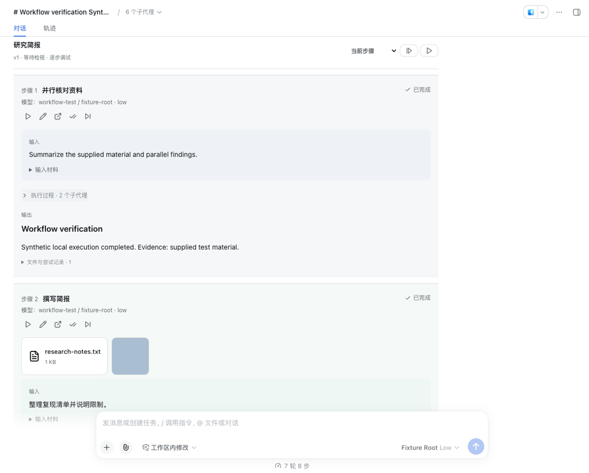

# DSH Omni

DSH Omni 是一套按固定版本装配的 DSH Desktop 环境：仓库里存放 16 个插件源码快照，
`setup.sh` 把它们组装成一个 Desktop profile，Release 里给出配套的桌面应用安装包。
使用者不需要逐个安装插件，也不会碰到插件之间的版本冲突——一个仓库、一个版本组合。

## 组成

| 目录 | 内容 |
| --- | --- |
| `setup.sh` | 把插件、profile 与启动器状态装配到目标 DSH home |
| `build-dmg.sh` | 从固定 revision 的桌面包编译出 dmg（维护者用） |
| `vendor/` | 16 个插件的源码快照，逐个固定在发布版本上 |
| `templates/` | profile 清单、pnpm 工作区与 `cordis.patch.yml` 模板 |
| `scripts/` | 装配、注册、校验与同步脚本 |
| `docs/` | 安装、构建与插件更新说明 |
| `manifest.json` | 唯一的版本清单：桌面 revision、插件版本与 commit、运行时依赖 |

插件集合：`dsh-plugin-suite`、`dsh-plugin-browser`、`dsh-plugin-project-memory`、
`dsh-plugin-ssh`、`dsh-plugin-terminal`、`dsh-plugin-sidebar`、`dsh-plugin-workbench`、
`dsh-plugin-workflow`、`dsh-plugin-sessions`、`dsh-plugin-latex`、`dsh-desktop-suite`、`dsh-desktop-workbench`、`dsh-better-reasoning-effort`、`dsh-pet`。

`dsh-better-reasoning-effort` 固定为 0.3.10（MIT），默认启用，提供模型推理强度配置、图片输入能力声明及对话输入区的推理强度滑块。上游源码和许可证保存在 `vendor/dsh-better-reasoning-effort/`。

`dsh-pet` 固定为 0.2.12（代码 MIT，动画素材由 AI 生成、全流程可复现），默认启用，提供桌面桌宠：工作状态联动（运行/等你确认/完成/出错）、多会话列表与翻档提示音、碎碎念与对话。安装时经其 `prepare` 脚本从源码构建（TypeScript 工具链已随插件依赖声明）。快照取自上游仓库的 `dsh-pet/` 子目录（manifest 以 `subdir` 标注）；本地保留 macOS Electron Framework 链接修复，并在 NEXT Desktop 中验证 Electron helper 启动。源码和许可证保存在 `vendor/dsh-pet/`。

## 安装

前提：macOS arm64、Node.js ≥ 24、npm、pnpm（`npm i -g pnpm`）。

```bash
# 1. 安装桌面应用（Release 里的 dmg，见下节“应用来源”）
# 2. 取本仓库
git clone https://github.com/hzxwonder/dsh-omni.git
cd dsh-omni

# 3. 一条命令装配
./setup.sh --app ~/Downloads/DSH-Desktop-2.0.14-arm64.dmg
```

`setup.sh` 顺序完成：安装应用（`--app` 给出 dmg 时）、安装每个插件的依赖、
写 `~/.dsh-desktop/profiles/desktop` 的清单与补丁层、解析 profile 依赖、
把 home 注册给启动器、跑一遍自检。装配完成后启动 DSH Desktop 即可，
模型 provider、凭据、SSH 连接与工作区都在应用自己的设置里配置。

常用参数：

| 参数 | 作用 |
| --- | --- |
| `--home <dir>` | 目标 DSH home，默认 `~/.dsh-desktop` |
| `--profile <name>` | Desktop profile 名，默认 `desktop` |
| `--app <dmg\|app>` | 先把应用安装到 `/Applications` 再装配 |
| `--skip-deps` | 跳过插件依赖安装（离线或已装过） |
| `--dry-run` | 只打印将要执行的动作 |

已经装好应用时直接 `./setup.sh` 即可：脚本会在 `/Applications` 找 `DSH Desktop.app`，
按它的运行时版本固定 profile 里的 `@deepseek-ai/*` 依赖。

## 来源与产品差异

DSH Omni 是面向 macOS 的预装插件集成发行版，源代码与版本组合由本仓库维护。
桌面壳来自 [hzxwonder/dsh-desktop](https://github.com/hzxwonder/dsh-desktop)，该仓库 fork 自
[anywhere-labs/dsh-desktop](https://github.com/anywhere-labs/dsh-desktop)。底层 Agent 运行时来自
[deepseek-ai/deepseek-harness](https://github.com/deepseek-ai/deepseek-harness)。具体提交和运行时版本见 `manifest.json`。

| 产品 | 来源与职责 | 插件分发 |
| --- | --- | --- |
| DSH Omni | 社区桌面壳的定制集成发行版；包含原生浏览器承载与固定版本插件组合 | 本仓库 `vendor/` 随发行版集成 |
| 官方 DeepSeek Harness Desktop | DeepSeek 官方仓库的 `apps/desktop`；官方签名、运行时和更新服务 | 独立安装官方 Desktop 适配插件 |
| 社区 DSH NEXT | anywhere-labs/dsh-desktop 的实验渠道；含 Profiles、恢复和社区市场 | 以该渠道的实际组合与验收为准 |

macOS 的日常安装保留 DSH Omni 与官方 DeepSeek Harness 两个应用。各自使用独立配置和数据目录。
官方 Desktop 适配插件发布在 [hzxwonder-dsh-plugins](https://github.com/orgs/hzxwonder-dsh-plugins/repositories)。
插件维护流程为：DSH Omni 开发与实机验收 → 更新本仓库 → 官方 Desktop 适配与实机验收 → 更新公开插件仓库。
维护范围为这两个桌面产品，Web 插件不再作为维护目标。

当前发行清单的 Stable 桌面基线为 2.0.14 / Harness 0.1.5-rc.2；NEXT 清单为 2.0.15-next / 0.1.7-rc.2。
Release 产物和安装脚本中的 `DSH Desktop` 文件名属于相应版本的实际安装名称。
官方 Desktop 0.1.7-rc.2 的公开插件验收与功能比较见 [桌面兼容报告](docs/official-desktop-compatibility.md)。

DSH Omni 的自构建安装包使用 ad-hoc 签名；官方 DeepSeek Harness 安装包由 DeepSeek 签名并公证。
安装方式见 [安装文档](docs/install.md)，构建方式见 [构建文档](docs/build.md)。

## 同款与不同款

装配脚本刻意区分两类内容：

- **随仓库分发**：插件 roster 与版本、profile 结构、`cordis.patch.yml` 的通用覆盖
  （关闭客户端 HMR、浏览器插件无头模式与 Chrome 路径）、界面与运行设置模板。
- **留给使用者**：模型 provider 与网关端点、API key、SSH 连接、工作区与会话。
  仓库里没有任何个人路径、凭据或历史会话。

界面状态（浏览器缩放、终端面板高度、侧栏页签）存在 localStorage 里，
按 origin 区分，端口由 home 路径派生并写进 `~/.dsh-desktop/settings.yaml` 一次，
之后由应用自己维护。

## 校验

```bash
node scripts/verify.mjs --home ~/.dsh-desktop --app "/Applications/DSH Desktop.app"
```

输出逐项确认：profile 三件套齐全、16 个插件全部从本仓库的 `vendor/` 解析、
没有任何插件回落到应用自带副本、声明 `dsh.client` 的包都导出了 `./package.json`、
运行时依赖已安装、补丁层无未渲染占位符。缺少 Chromium 时给警告而非失败
（浏览器插件可改用 `DSH_CHROME_EXECUTABLE` 指向本机 Chrome）。

要在真实壳里确认插件注册，用运行校验：

```bash
# 需要先退出正在运行的 DSH Desktop：单实例锁按应用生效，第二个实例会立刻退出
node scripts/verify-runtime.mjs --app "/Applications/DSH Desktop.app"
```

启动器打开的 home 由它在 Electron userData 里的定位文档决定，环境变量改不了，
所以脚本先读出该 home 再启动应用，通过 DevTools 协议核对：渲染进程请求的客户端插件包
是否包含本仓库 vendor 的全部客户端插件、控制台与网络有没有失败。
输出里的 `launcher` 一行就是这次实际检查的 home；`--home` 只用于声明期望值。

## 维护

```bash
node scripts/vendor.mjs --from <插件源码根目录>   # 按各仓库当前 HEAD 刷新 vendor/ 与版本
node scripts/vendor.mjs --check                   # 只报告偏差
./build-dmg.sh --ref <revision>                   # 出新 dmg
```

同步与发版流程见 [docs/vendor.md](docs/vendor.md)。

## 许可

`vendor/` 下各插件保留其原始许可（LGPL-3.0-only、LGPL-3.0-or-later 与 MIT，
逐个见各自 `LICENSE`）；本仓库的脚本与文档同插件族一致，采用 LGPL-3.0-only。
桌面壳来自 [anywhere-labs/dsh-desktop](https://github.com/anywhere-labs/dsh-desktop) 的 fork，
按上游 MIT 许可使用。


## Workflow Notebook

工作流 0.3.0 提供左对齐的步骤对话、淡色分步背景、编辑器调试设置和图标工具栏。总会话及独立步骤页均可编辑本次运行的 prompt、添加附件并单步重跑；步骤保留结论、文件、模型与本地快照。



本版本的插件单元测试与 Web 行为测试通过。Desktop 兼容模式的内容区恢复仍有待修复问题，完整产品验收尚未通过。详见[验收报告与截图](https://github.com/hzxwonder-dsh-plugins/dsh-plugin-workflow/blob/main/docs/acceptance-report.md)。

## LaTeX 论文工作台

`dsh-plugin-latex` 提供本地论文项目选择、LaTeX / PDF 双栏、审阅选择与原生 Harness 对话抽屉。模型生成四级行文导图，并复用未改段落的分析结果。编译需本机安装 TeX Live 或 MacTeX 与 `latexmk`，模型沿用 Desktop 设置。


详见 [插件说明](vendor/dsh-plugin-latex/README.md) 和 [验收报告](https://github.com/hzxwonder-dsh-plugins/dsh-plugin-latex/blob/main/docs/ACCEPTANCE.md)。演示由合成论文的实际 Desktop 操作截图组成。

## 提示词库

在聊天框输入 `/prompt`，直接从候选菜单选择已保存的模板，将正文添加到聊天框。选择“新建 Prompt 模板”打开双栏管理窗口：左侧选择或新建模板，右侧编辑名称与正文，底部提供复制、删除和保存。复制会立即创建并选中“原名称 - copy”模板，使用当前编辑器中的正文；同名副本自动追加编号。支持保存失败重试、删除确认和未保存内容保护。

Desktop 2.0.14 的完整应用提供配套的界面和数据接口。构建默认使用 `manifest.json` 的精确提交，打包后运行提示词前后端配套校验。
