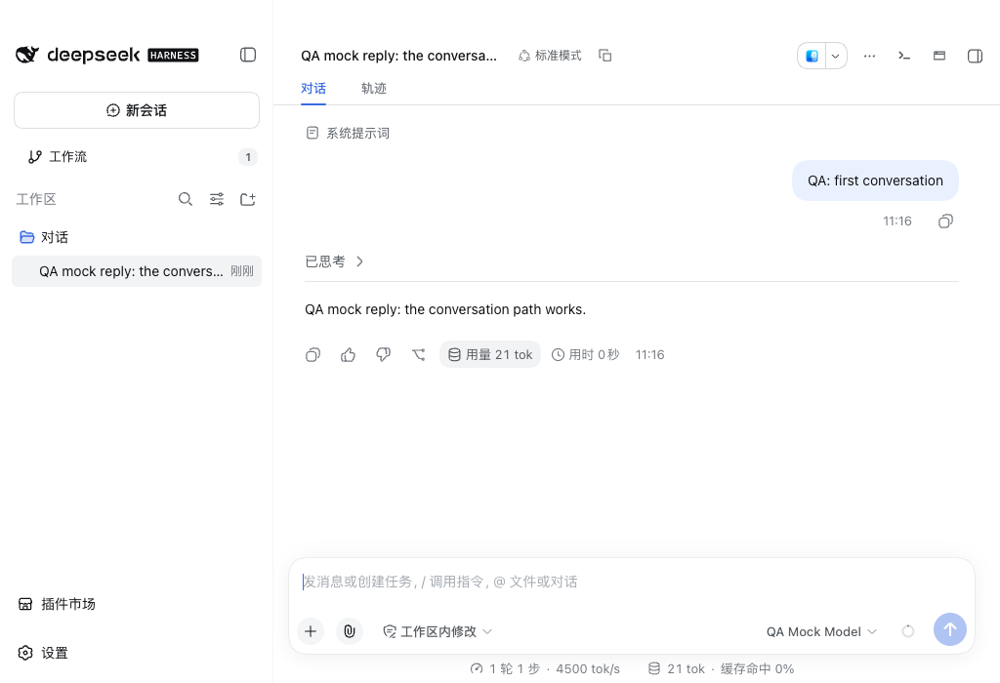
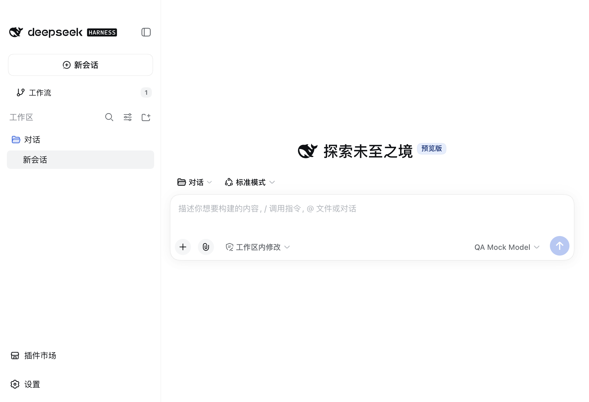
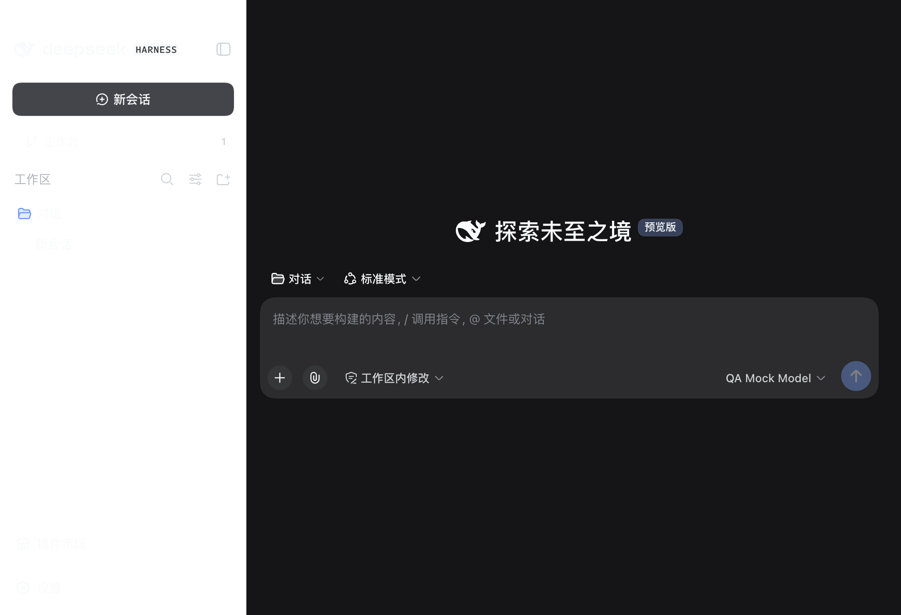
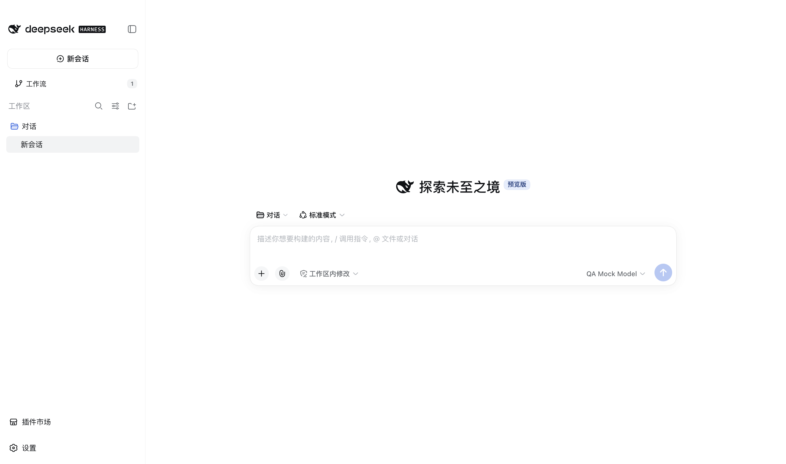
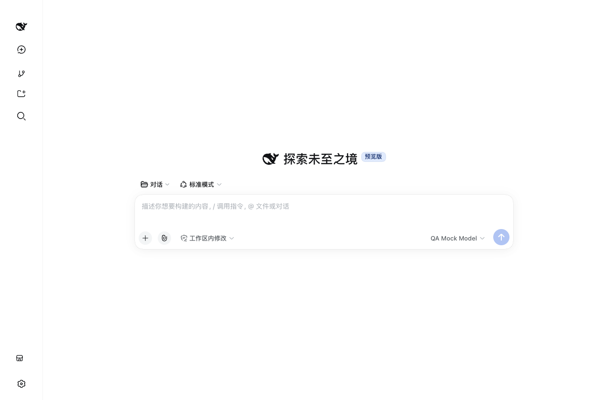
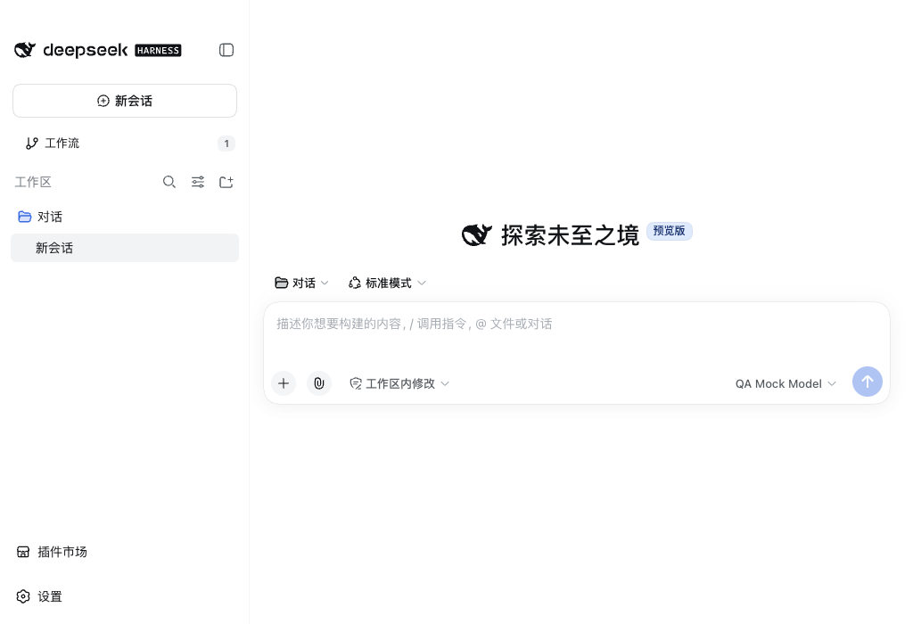
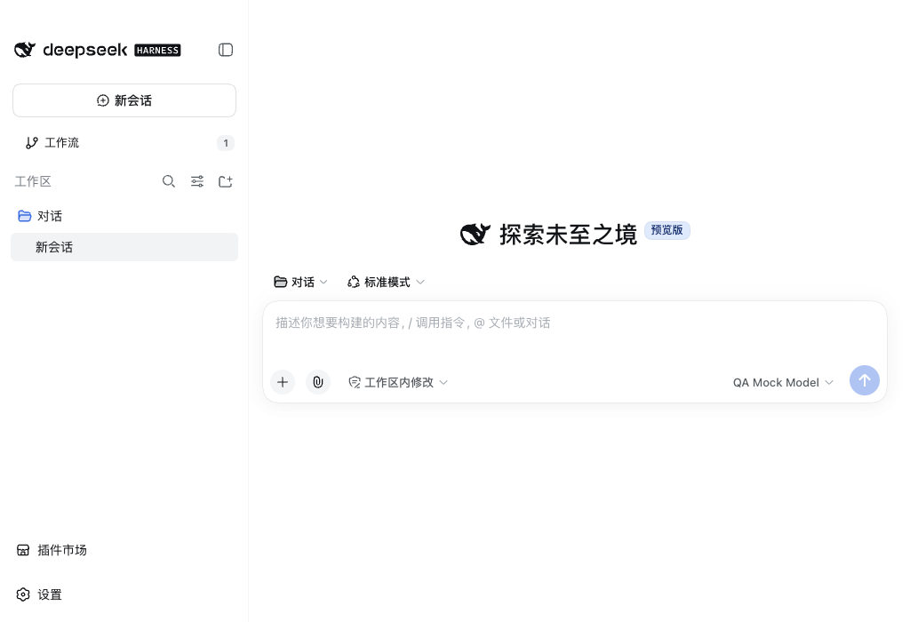
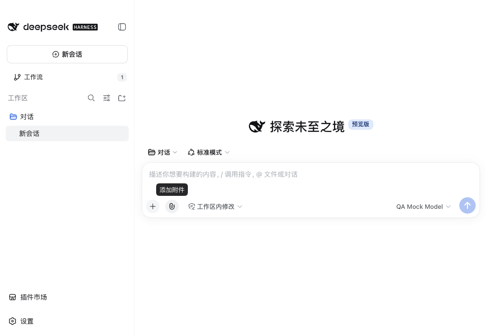
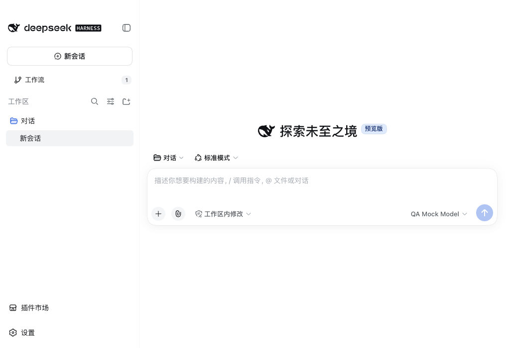
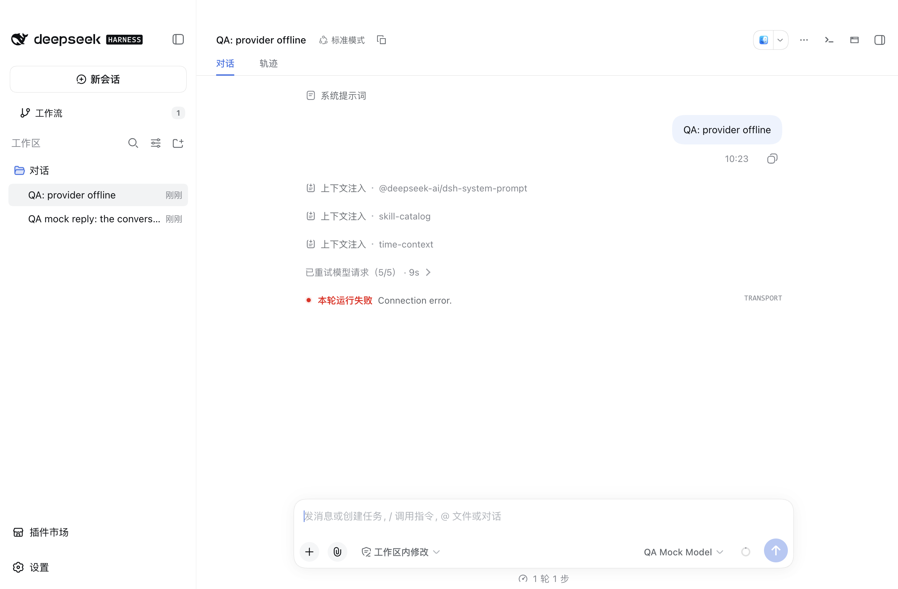

# DSH Desktop 打包版验收报告

生成时间：2026-09-18 11:39　应用版本：2.0.10（DSH 运行时 0.1.5-rc.2）　安装包：DSH-Desktop-2.0.10-arm64.dmg

## 一、结论

本轮共执行 **76** 条用例：**通过 68**、失败 8、跳过 0。

用例覆盖启动与生命周期、窗口与进程、主题、布局、功能链路、鲁棒性、仓库隐私七组，其中 P0 10 条、P1 50 条、P2 16 条；完整清单见 `qa/cases.md`。

主流程（启动、会话、主题、布局、面板、异常输入）可用，没有出现数据损坏或会话丢失；下面 4 项需要处理，其中 F-1 影响窗口唤回并伴随未捕获异常，F-2 属于已发布仓库的隐私泄露：

- **F-1 · 高 · 窗口关闭后无法唤回：激活路径访问已销毁的窗口并抛出未捕获异常** —— 对应用例 B-02、B-03、B-04
- **F-2 · 高（隐私） · 已发布插件仓库的验收文档包含本机个人路径与私有 SSH 别名** —— 对应用例 P-01、P-02、P-04
- **F-3 · 低 · 空输入回车会新建空会话** —— 对应用例 R-01
- **F-4 · 低 · 浅色主题次级文字对比度低于 WCAG AA** —— 对应用例 L-05

## 二、测试环境与方法

| 项目 | 值 |
| --- | --- |
| 操作系统 | macOS 26.5.1 (25F80) |
| 硬件 | Apple M2 Pro，16 GB |
| 屏幕 | 内置 Retina，逻辑分辨率 1280×840 |
| 被测程序 | /Applications/DSH Desktop.app（打包版 2.0.10） |
| 控制方式 | Chrome DevTools Protocol（渲染进程真实 DOM 与截屏） |

测试在一个独立的 fixture home 中进行，用户日常使用的 home 全程未被写入；
推理走本地 mock 模型服务（OpenAI 兼容接口），不使用任何真实密钥。
窗口关闭、重开、后台冻结、进程退出等场景通过 DevTools 协议与进程信号驱动，
因为测试进程没有 macOS 辅助功能权限，无法注入原生菜单快捷键；受限项在第六节列出。

## 三、用例与结果

### A　启动与会话生命周期（10/10 通过）

| 用例 | 优先级 | 标题 | 结果 | 耗时/说明 |
| --- | --- | --- | --- | --- |
| A-01 | P0 | 冷启动进入主界面且输入框可用 | 通过 | 31ms |
| A-02 | P1 | 首次运行的欢迎浮层可关闭且不阻塞输入 | 通过 | 2ms |
| A-03 | P0 | 新建会话进入可输入状态 | 通过 | 2757ms |
| A-04 | P0 | 发出消息后收到回复且会话被记录 | 通过 | 21157ms |
| A-05 | P1 | 连续创建 3 个会话各自独立 | 通过 | 61788ms |
| A-06 | P1 | 快速连点新建会话不产生重复会话 | 通过 | 5852ms |
| A-07 | P1 | 会话之间切换内容不串 | 通过 | 5172ms |
| A-08 | P1 | 刷新渲染进程后会话记录保持 | 通过 | 13048ms |
| A-09 | P2 | 工作区菜单可打开并给出工作区入口 | 通过 | 1693ms |
| A-10 | P2 | 输入超长草稿不卡死 | 通过 | 8364ms |

### B　关闭、后台化、重开与进程行为（7/10 通过）

| 用例 | 优先级 | 标题 | 结果 | 耗时/说明 |
| --- | --- | --- | --- | --- |
| B-01 | P0 | 关闭窗口后应用按设计驻留后台 | 通过 | 26958ms |
| B-02 | P0 | 再次启动应用后窗口与会话列表恢复 | 失败 | no renderer target on port 9470 to attach to |
| B-03 | P1 | 重开后窗口几何保持 | 失败 | Runtime.evaluate timed out |
| B-04 | P1 | 点击 Dock 图标后窗口能够回来 | 失败 | the Dock icon did not bring the window back (TypeError: Object has been destroyed \|     at applicationNeedsReveal (file:///Applications/DSH%20Desktop.app/Contents/Resources/app/lib/electron-runtime-Ih8J4IqG.js:1434:16) \|     at EventEmitter.activate (file:///Applicatio) |
| B-05 | P1 | 收到退出请求后进程干净退出 | 通过 | 8092ms |
| B-06 | P1 | 重启后会话记录与几何恢复 | 通过 | 12643ms |
| B-07 | P1 | 窗口尺寸变更后重启仍保持 | 通过 | 14554ms |
| B-08 | P1 | 后台冻结后恢复内容与输入都正常 | 通过 | 7096ms |
| B-09 | P1 | 应用已运行时再次启动不产生第二实例 | 通过 | 4556ms |
| B-10 | P2 | 强制结束后重启数据仍可读 | 通过 | 15923ms |

### D　主题与外观（6/6 通过）

| 用例 | 优先级 | 标题 | 结果 | 耗时/说明 |
| --- | --- | --- | --- | --- |
| D-01 | P1 | 启动主题与系统外观一致 | 通过 | 554ms |
| D-02 | P1 | 系统外观变化时界面即时跟随 | 通过 | 6487ms |
| D-03 | P1 | 浅色主题下不存在残留的深色大色块 | 通过 | 6586ms |
| D-04 | P1 | 深色主题下不存在残留的浅色大色块 | 通过 | 1888ms |
| D-05 | P2 | 快速反复切换主题 10 次后界面正常 | 通过 | 12551ms |
| D-06 | P1 | 切换主题不丢失当前会话内容 | 通过 | 26285ms |

### L　布局与样式校验（14/15 通过）

| 用例 | 优先级 | 标题 | 结果 | 耗时/说明 |
| --- | --- | --- | --- | --- |
| L-01 | P1 | 基准窗口无横向溢出与意外滚动条 | 通过 | 77ms |
| L-02 | P1 | 基准布局几何符合设计意图 | 通过 | 5ms |
| L-03 | P1 | 交互元素之间无遮挡重叠 | 通过 | 46ms |
| L-04 | P2 | 文本不被裁切或溢出容器 | 通过 | 1ms |
| L-05 | P1 | 浅色主题正文对比度达到 4.5:1 | 失败 | lowest text contrast in light theme is 3.71:1 ([{"role":"text","text":"工作区","color":"rgb(129, 133, 140)","background":"rgb(255, 255, 255)","fontSize":14,"large":false,"ratio":3.71},{"role":"text","text":"工作区内修改","color":"rgb(97, 102, 107)","background":"rgb(255, 255, 255)","fontSize":13,"large":fals |
| L-06 | P1 | 深色主题正文对比度达到 4.5:1 | 通过 | 5138ms |
| L-07 | P1 | 主题切换即时生效且可回退 | 通过 | 10357ms |
| L-08 | P1 | 窗口放大到 1600×1000 布局自适应 | 通过 | 2149ms |
| L-09 | P1 | 窗口缩小到 900×600 关键控件仍可用 | 通过 | 2060ms |
| L-10 | P2 | 极小窗口 640×480 不破坏布局 | 通过 | 2052ms |
| L-11 | P2 | 恢复基准尺寸后布局回到原状 | 通过 | 2561ms |
| L-12 | P2 | 侧边栏收起与展开后几何稳定 | 通过 | 3347ms |
| L-13 | P2 | 侧边栏收起为图标栏时布局正常 | 通过 | 3280ms |
| L-14 | P1 | 终端面板打开后输入框仍完整可见 | 通过 | 2ms |
| L-15 | P2 | 多次开合侧边栏后几何无累积偏移 | 通过 | 8153ms |

### F　功能链路（13/13 通过）

| 用例 | 优先级 | 标题 | 结果 | 耗时/说明 |
| --- | --- | --- | --- | --- |
| F-01 | P1 | 工作区列表与新建会话入口可用 | 通过 | 30ms |
| F-02 | P1 | 工作区切换菜单可打开并列出工作区 | 通过 | 2494ms |
| F-03 | P1 | 搜索会话入口可与输入框交互 | 通过 | 2368ms |
| F-04 | P1 | 插件市场面板可打开 | 通过 | 2464ms |
| F-05 | P1 | 设置面板可打开 | 通过 | 2461ms |
| F-06 | P1 | 视图选项菜单可打开 | 通过 | 2471ms |
| F-07 | P1 | 模型选择器列出已配置模型 | 通过 | 2380ms |
| F-08 | P1 | 访问模式菜单可打开并列出模式 | 通过 | 2362ms |
| F-09 | P2 | 指令入口可打开 | 通过 | 2362ms |
| F-10 | P2 | 斜杠指令在输入框中给出候选 | 通过 | 2657ms |
| F-11 | P1 | 右侧边栏与终端面板可开合 | 通过 | 4394ms |
| F-12 | P1 | 附件入口可用 | 通过 | 2361ms |
| F-13 | P2 | 连续打开并关闭各入口后应用仍可用 | 通过 | 10774ms |

### R　鲁棒性与异常输入（13/14 通过）

| 用例 | 优先级 | 标题 | 结果 | 耗时/说明 |
| --- | --- | --- | --- | --- |
| R-01 | P0 | 空输入回车不产生空会话 | 失败 | empty submissions created 1 conversation(s) |
| R-02 | P1 | 粘贴超长文本不崩溃且可继续操作 | 通过 | 4867ms |
| R-03 | P1 | 表情、CJK 与控制字符混合输入正确回显 | 通过 | 3180ms |
| R-04 | P1 | 发送过程中重复回车不产生重复消息 | 通过 | 22872ms |
| R-05 | P0 | 模型服务不可用时错误可见且界面可继续使用 | 通过 | 24258ms |
| R-06 | P1 | 模型服务恢复后可以继续发送 | 通过 | 20772ms |
| R-07 | P1 | 回答生成中关闭窗口后重启无损坏 | 通过 | 19000ms |
| R-08 | P1 | 连续刷新 5 次无错误且状态保持一致 | 通过 | 25619ms |
| R-09 | P2 | 快速切换会话 20 次不崩溃 | 通过 | 49793ms |
| R-10 | P1 | 控件快速连点 20 次不产生异常状态 | 通过 | 9587ms |
| R-11 | P1 | 空数据目录启动进入可引导状态 | 通过 | 18385ms |
| R-12 | P1 | 全新 Profile 首次启动的桌面设置向导可跳过 | 通过 | 31269ms |
| R-13 | P1 | 配置损坏时进入恢复模式而不是空白页 | 通过 | 23093ms |
| R-14 | P2 | 长时间空转后仍能响应输入 | 通过 | 48117ms |

### P　仓库隐私与脱敏（5/8 通过）

| 用例 | 优先级 | 标题 | 结果 | 耗时/说明 |
| --- | --- | --- | --- | --- |
| P-01 | P0 | 工作区文件不含个人路径与用户名 | 失败 | personal data in tracked files: [{"path":"docs/acceptance/2026-09-15-terminal-panel.md","line":11,"rule":"private-project"},{"path":"docs/acceptance/2026-09-15-terminal-panel.md","line":171,"rule":"person-name"},{"path":"docs/acceptance/2026-09-15-terminal-panel.md","line":195,"rule":"person-name"}, |
| P-02 | P0 | 全部提交历史不含个人路径与用户名 | 失败 | personal data in history: [{"repository":"dsh-plugins/repositories/dsh-plugin-terminal","path":"docs/acceptance/2026-09-15-terminal-panel.md","line":11,"rule":"private-project"},{"repository":"dsh-plugins/repositories/dsh-plugin-terminal","path":"docs/acceptance/2026-09-15-terminal-panel.md","line": |
| P-03 | P0 | 没有任何凭据文件被提交 | 通过 | 479ms |
| P-04 | P1 | 不含真实密钥、私有端点或私有项目名 | 失败 | secret-like data found: [{"repository":"dsh-plugins/repositories/dsh-plugin-terminal","path":"docs/acceptance/2026-09-15-terminal-panel.md","line":11,"rule":"private-project"},{"repository":"dsh-plugins/repositories/dsh-plugin-terminal","path":"docs/acceptance/2026-09-15-terminal-panel.md","line":21 |
| P-05 | P1 | 发布磁盘镜像内不含用户数据 | 通过 | 1351ms |
| P-06 | P2 | 仓库不引入遥测或第三方上报 | 通过 | 258ms |
| P-07 | P1 | 验收证据本身不泄露个人数据 | 通过 | 6ms |
| P-08 | P1 | 验收过程未触碰真实用户数据目录 | 通过 | 56ms |

## 四、界面证据


*冷启动后的主界面*



*首次对话得到模型回复*


*连续创建三个会话*



*浅色主题*



*深色主题*



*放大到 1600×1000*


*缩小到 900×600*


*最小尺寸 640×480*



*侧边栏收起*



*插件市场面板*



*设置面板*



*模型选择器*



*终端面板打开*



*模型服务不可用时的提示*

## 五、问题清单

### F-1　窗口关闭后无法唤回：激活路径访问已销毁的窗口并抛出未捕获异常

- 严重程度：高　相关用例：B-02、B-03、B-04
- 现象：关闭主窗口后进程按设计驻留（B-01 通过）。此后点击 Dock 图标、或用 `open -a "DSH Desktop"`、或以命令行再次启动应用，都不会出现窗口；应用日志记录 `TypeError: Object has been destroyed`，调用栈为 `applicationNeedsReveal` → `EventEmitter.activate`（electron-runtime-Ih8J4IqG.js:1434 / 2631）。实测中激活后进程数由 5 降到 4，单独探针里甚至整体退出。
- 影响：用户关掉窗口后没有任何常规操作能把界面找回来，只能退出应用重新启动；未捕获异常还会让主进程处于不确定状态，容易被当成崩溃。这是本轮唯一影响主流程可用性的缺陷。
- 复现：启动应用并关闭窗口 → 进程仍在（`pgrep -f "MacOS/DSH Desktop"` 非空）→ `open -a "/Applications/DSH Desktop.app"` → 无窗口出现，`~/Library/Application Support/DSH Desktop/logs/dsh-*.error.log` 写入上述栈；对应用例 `node qa/run-cases.mjs run B`。
- 证据：`evidence/dock-activation-crash.log`（日志原文）、`evidence/reopen-behaviour.json`（三次激活路径下的进程数与渲染目标采样）
- 建议：在 `activate` / `second-instance` 处理器里先判断窗口是否已销毁（`window.isDestroyed()`），销毁时重建窗口后再 `show()`；同时确认 `window-all-closed` 的驻留策略与唤起入口成对存在（托盘菜单或 Dock 双击）。

### F-2　已发布插件仓库的验收文档包含本机个人路径与私有 SSH 别名

- 严重程度：高（隐私）　相关用例：P-01、P-02、P-04
- 现象：`dsh-plugin-terminal` 仓库（远程 `github.com/hzxwonder-dsh-plugins/dsh-plugin-terminal`）中，`docs/acceptance/2026-09-15-terminal-panel.md` 第 171、195 行写着 `/Users/<user>/.dsh-desktop/plain-sessions…`，第 11、219、220 行出现私有 SSH 连接别名；`docs/acceptance/2026-09-15/results.json` 第 17、310、316 行同样命中。这些内容既在工作区文件中，也已经进入提交历史。
- 影响：公开仓库里泄露本机用户名、目录结构与私有 SSH 主机别名，等于给出内网与账号线索；仅改当前文件无法从历史中移除。
- 复现：`node qa/run-cases.mjs run P`（用例 P-01 / P-02 / P-04），扫描覆盖 12 个仓库的工作区文件、未跟踪文件与全部历史 blob。
- 证据：`evidence/privacy.json`（逐条命中：仓库、文件、行号、规则）
- 建议：把文档与结果文件里的绝对路径改为 `~/.dsh-desktop/...`、把 SSH 别名替换为 `<ssh-alias>`，并补一条提交前检查；历史清理需要 force push，属于不可逆操作，确认后再执行。

### F-3　空输入回车会新建空会话

- 严重程度：低　相关用例：R-01
- 现象：在空输入框里连按回车（含一次只输入空格再回车）后，侧边栏多出一个空的“新会话”条目，界面没有报错，输入框仍可用。
- 影响：误触回车会在工作区里留下空会话，长期使用会积累无用条目，也会影响“会话数=真实对话数”的直觉。
- 复现：`node qa/run-cases.mjs run R-01`：记录侧边栏条目数 → 空输入按 3 次回车 → 输入空格再回车 → 条目数 +1。
- 证据：`evidence/R-01-failure.png`（回车后侧边栏新增空条目）
- 建议：提交前去掉首尾空白并判断是否为空；空内容不创建会话，也不写入工作区。

### F-4　浅色主题次级文字对比度低于 WCAG AA

- 严重程度：低　相关用例：L-05
- 现象：浅色主题下侧边栏分组标题“工作区”为 rgb(129,133,140) on #ffffff，对比度 3.71:1，低于 AA 要求的 4.5:1；输入框占位文字 2.13:1。正文与控件文字合格（同一轮采样中“工作区内修改”“QA Mock Model”均为 5.8:1）。深色主题最低 8.78:1，占位文字 3.76:1。
- 影响：低视力用户在浅色主题下较难辨认分组标题与占位提示，属于可访问性层面的缺陷，不影响功能。
- 复现：`node qa/run-cases.mjs run L-05`：切到浅色主题，逐元素计算前景色与背景色的对比度。
- 证据：`evidence/L-05-light-theme.png`、`evidence/L-05-failure.png`（采样明细写入用例说明）
- 建议：把分组标题与占位文字调深到至少 4.5:1（例如 #6b7280 附近），或提高字号使其达到大字号阈值。

### 观察项（未判为失败，但值得关注）

- 重复回车曾出现过一次重复发送：R-04 在 00:23 那轮记录到同一条消息被发送 2 次，11:11 重跑未复现（运行 22.9s、仅 1 条）。属于竞态型现象，建议在发送按钮上加去抖或提交锁后再复测。
- 侧边栏收起后，展开入口是图标栏里的“打开侧边栏”按钮（无文字标签），自动发现性较弱；本轮已按该标签完成收起/展开与多次开合验证（L-12、L-13、L-15 通过）。
- 空数据目录或全新 Profile 启动时没有工作区，界面停留在“选择一个工作区开始”，输入框不出现（R-11、R-12 按此预期判定通过）；首次使用者需要先添加工作区才能开始对话。

## 六、未覆盖与受限项

| 项目 | 原因 | 建议的替代验证 |
| --- | --- | --- |
| ⌘Q / ⌘W / ⌘M / ⌘H 原生快捷键 | 测试进程无 macOS 辅助功能权限，无法注入系统按键 | 用关闭窗口、SIGTERM 与后台冻结三条路径覆盖同一后果；手工按一次快捷键确认 |
| 真实模型的长回答与工具调用 | 全程使用 mock 模型，避免真实密钥与费用 | 用自有 API Key 跑一次真实任务，检查轨迹面板与用量统计 |
| 多显示器与 HiDPI 缩放 | 只在单屏内置显示器上验证 | 外接显示器后再跑一次 L 组 |
| 系统级通知、托盘菜单交互 | 需要窗口服务器控制权限 | 手工点开托盘菜单确认退出与安全模式入口 |

## 七、判定口径与证据索引

| 维度 | 判定口径 |
| --- | --- |
| 功能 | 真实点击与键盘输入后，界面出现预期结果，且渲染进程无 console 报错 |
| 布局 | 基准 1280×840 下无横向溢出、交互元素互不遮挡、文字不被裁切；尺寸变化后几何偏差 ≤ 8px |
| 对比度 | 正文与控件文字 ≥ 4.5:1，占位文字单独记录（WCAG AA） |
| 生命周期 | 关窗后进程驻留、退出后无残留进程、重启后会话与几何恢复 |
| 隐私 | 12 个仓库的工作区文件、未跟踪文件与全部历史 blob 均无个人路径、用户名、私有别名、密钥 |

证据文件都在 `qa/evidence/`：截图以用例编号命名（`<用例>-<场景>.png`，失败现场为 `<用例>-failure.png`），`results.json` 保存逐条结果与说明，`privacy.json` 保存隐私扫描命中，`dock-activation-crash.log` 与 `reopen-behaviour.json` 是 F-1 的原始证据，`log-*.txt` 是各组运行日志。

## 八、复现方式

```bash
# 准备独立的测试 home（不会改动日常使用的数据目录）
node dsh-plugins/distribution/dsh-desktop-bundle/qa/setup-qa.sh fixture
node dsh-plugins/distribution/dsh-desktop-bundle/qa/configure-provider.mjs
node dsh-plugins/distribution/dsh-desktop-bundle/qa/mock-llm.mjs --port 43921 &

# 执行全部用例并生成报告
cd dsh-plugins/distribution/dsh-desktop-bundle
node qa/run-cases.mjs capture
node qa/run-cases.mjs run all
node qa/report.mjs
```

