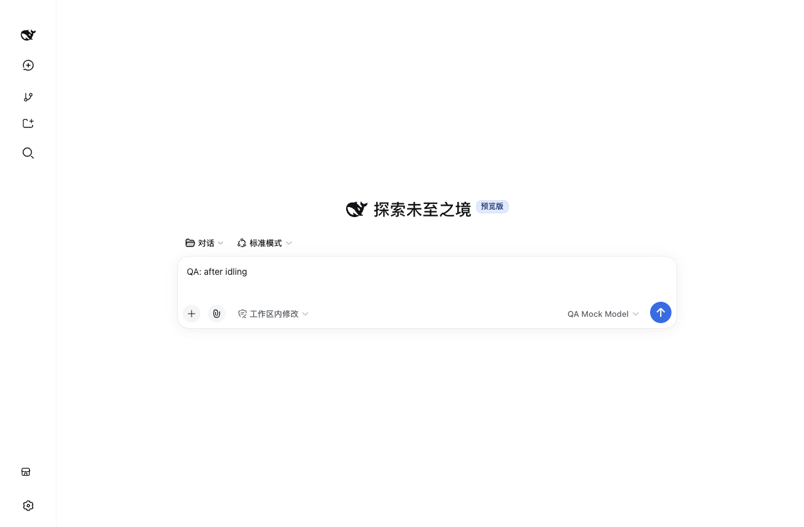

# DSH Desktop 打包版验收报告

生成时间：2026-09-21 16:31　应用版本：2.0.14（DSH 运行时 0.1.5-rc.2）　安装包：DSH-Desktop-2.0.14-arm64.dmg

## 一、结论

本轮共执行 **77** 条用例：**通过 71**、失败 2、跳过 4。

用例覆盖启动与生命周期、窗口与进程、主题、布局、功能链路、鲁棒性、仓库隐私七组，其中 P0 10 条、P1 51 条、P2 16 条；完整清单见 `qa/cases.md`。

主流程（启动、会话、主题、布局、面板、异常输入、仓库隐私）可用，没有出现数据损坏或会话丢失。下面 1 项未通过：

- **F-1 · 低（可访问性） · 次级文字对比度低于 WCAG AA（浅色 2.13:1、深色 3.76:1）** —— 对应用例 L-05、L-06

另有 4 条用例在本机无法产生被测刺激（关闭窗口要由窗口服务器投递，测试进程没有辅助功能权限），按“未验证”记录而不计入失败：B-01、B-02、B-03、B-04；其中由探针直接复现的健壮性缺口见 F-2。

- ~~F-4 · 低 · 空输入回车会新建空会话（2.0.10 轮次遗留）~~ —— 已修复：对应用例 R-01、R-04 复验通过，见第五节

- ~~F-3 · 高（隐私） · 隐私审查曾把本机标识与家目录路径写入提交历史、证据文件和验收工具~~ —— 已修复：对应用例 P-01、P-02、P-03、P-04、P-07 复验通过，见第五节

## 二、测试环境与方法

| 项目 | 值 |
| --- | --- |
| 操作系统 | macOS 26.5.1 (25F80) |
| 硬件 | Apple M2 Pro，16 GB |
| 屏幕 | 内置 Retina，逻辑分辨率 1280×840 |
| 被测程序 | /Applications/DSH Desktop.app（打包版 2.0.14） |
| 控制方式 | Chrome DevTools Protocol（渲染进程真实 DOM 与截屏） |

测试在一个独立的 fixture home 中进行，用户日常使用的 home 全程未被写入；
隐私审查覆盖分发仓库与 13 个插件仓库（工作区、未跟踪文件与全部提交历史），结果见附录 A。
推理走本地 mock 模型服务（OpenAI 兼容接口），不使用任何真实密钥。
关闭窗口由窗口服务器投递（红灯或 ⌘W），测试进程没有 macOS 辅助功能权限，
因此 B-01…B-04 在无法投递该请求的主机上按“未验证”记录，而不是用渲染进程的 `window.close()` 替代——那条路径会销毁 web contents 且不经过应用的关闭处理器，是用户无法到达的状态；进程退出与重启后的会话、几何恢复由 B-05、B-06 覆盖。其余受限项在第六节列出。

## 三、用例与结果

### A　启动与会话生命周期（11/11 通过）

| 用例 | 优先级 | 标题 | 结果 | 耗时/说明 | 截图 |
| --- | --- | --- | --- | --- | --- |
| A-01 | P0 | 冷启动进入主界面且输入框可用 | 通过 | 81ms | [图](evidence/A-01-boot.png) |
| A-02 | P1 | 首次运行的欢迎浮层可关闭且不阻塞输入 | 通过 | 20ms | — |
| A-03 | P0 | 新建会话进入可输入状态 | 通过 | 2725ms | [图](evidence/A-03-new-conversation.png) |
| A-04 | P0 | 发出消息后收到回复且会话被记录 | 通过 | 21194ms | [图](evidence/A-04-first-reply.png) |
| A-05 | P1 | 连续创建 3 个会话各自独立 | 通过 | 61726ms | [图](evidence/A-05-three-conversations.png) |
| A-06 | P1 | 快速连点新建会话不产生重复会话 | 通过 | 5888ms | [图](evidence/A-06-rapid-new-conversation.png) |
| A-07 | P1 | 会话之间切换内容不串 | 通过 | 5135ms | [图](evidence/A-07-switched.png) |
| A-08 | P1 | 刷新渲染进程后会话记录保持 | 通过 | 13096ms | [图](evidence/A-08-after-reload.png) |
| A-09 | P2 | 工作区菜单可打开并给出工作区入口 | 通过 | 1757ms | [图](evidence/A-09-workspace-menu.png) |
| A-10 | P2 | 输入超长草稿不卡死 | 通过 | 8621ms | [图](evidence/A-10-long-input.png) |
| A-11 | P1 | 首轮对话全程无失败请求与控制台错误 | 通过 | 20576ms | [图](evidence/A-11-network-clean.png) |

### B　关闭、后台化、重开与进程行为（6/10 通过）

| 用例 | 优先级 | 标题 | 结果 | 耗时/说明 | 截图 |
| --- | --- | --- | --- | --- | --- |
| B-01 | P0 | 关闭窗口后应用按设计驻留后台 | 跳过 | the window server did not deliver the close request, so the window never closed | — |
| B-02 | P0 | 再次启动应用后窗口与会话列表恢复 | 跳过 | the window never closed, so reopening it cannot be verified | — |
| B-03 | P1 | 重开后窗口几何保持 | 跳过 | the window never closed, so its reopening cannot be verified | — |
| B-04 | P1 | 点击 Dock 图标后窗口能够回来 | 跳过 | the window server did not deliver the close request, so the window never closed | — |
| B-05 | P1 | 收到退出请求后进程干净退出 | 通过 | 8067ms | — |
| B-06 | P1 | 重启后会话记录与几何恢复 | 通过 | 13513ms | [图](evidence/B-06-after-restart.png) |
| B-07 | P1 | 窗口尺寸变更后重启仍保持 | 通过 | 14744ms | [1](evidence/B-07-resized-before-restart.png) [2](evidence/B-07-resized-after-restart.png) |
| B-08 | P1 | 后台冻结后恢复内容与输入都正常 | 通过 | 7089ms | [图](evidence/B-08-after-background-return.png) |
| B-09 | P1 | 应用已运行时再次启动不产生第二实例 | 通过 | 4441ms | [图](evidence/B-09-second-instance.png) |
| B-10 | P2 | 强制结束后重启数据仍可读 | 通过 | 15816ms | [图](evidence/B-10-after-forced-kill.png) |

### D　主题与外观（6/6 通过）

| 用例 | 优先级 | 标题 | 结果 | 耗时/说明 | 截图 |
| --- | --- | --- | --- | --- | --- |
| D-01 | P1 | 启动主题与系统外观一致 | 通过 | 223ms | [图](evidence/D-01-boot-light.png) |
| D-02 | P1 | 系统外观变化时界面即时跟随 | 通过 | 6356ms | [图](evidence/D-02-switched-dark.png) |
| D-03 | P1 | 浅色主题下不存在残留的深色大色块 | 通过 | 1806ms | [图](evidence/D-03-light-surfaces.png) |
| D-04 | P1 | 深色主题下不存在残留的浅色大色块 | 通过 | 7722ms | [图](evidence/D-04-dark-surfaces.png) |
| D-05 | P2 | 快速反复切换主题 10 次后界面正常 | 通过 | 16872ms | [图](evidence/D-05-after-theme-cycles.png) |
| D-06 | P1 | 切换主题不丢失当前会话内容 | 通过 | 27565ms | [图](evidence/D-06-conversation-after-theme.png) |

### L　布局与样式校验（13/15 通过）

| 用例 | 优先级 | 标题 | 结果 | 耗时/说明 | 截图 |
| --- | --- | --- | --- | --- | --- |
| L-01 | P1 | 基准窗口无横向溢出与意外滚动条 | 通过 | 67ms | [图](evidence/L-01-baseline.png) |
| L-02 | P1 | 基准布局几何符合设计意图 | 通过 | 2ms | — |
| L-03 | P1 | 交互元素之间无遮挡重叠 | 通过 | 45ms | [图](evidence/L-03-overlap-check.png) |
| L-04 | P2 | 文本不被裁切或溢出容器 | 通过 | 1ms | — |
| L-05 | P1 | 浅色主题正文对比度达到 4.5:1 | 失败 | lowest text contrast in light theme is 2.13:1 ([{"role":"text","text":"Medium","color":"rgb(173, 178, 184)","background":"rgb(255, 255, 255)","fontSize":13,"large":false,"ratio":2.13},{"role":"text","text":"工作区","color":"rgb(129, 133, 140)","background":"rgb(255, 255, 255)","fontSize":14,"large":fal | [图](evidence/L-05-light-theme.png) |
| L-06 | P1 | 深色主题正文对比度达到 4.5:1 | 失败 | lowest text contrast in dark theme is 3.76:1 ([{"role":"text","text":"Medium","color":"rgb(129, 133, 140)","background":"rgb(44, 44, 46)","fontSize":13,"large":false,"ratio":3.76},{"role":"text","text":"工作区","color":"rgb(173, 178, 184)","background":"rgb(18, 18, 18)","fontSize":14,"large":false,"rat | [图](evidence/L-06-dark-theme.png) |
| L-07 | P1 | 主题切换即时生效且可回退 | 通过 | 6757ms | — |
| L-08 | P1 | 窗口放大到 1600×1000 布局自适应 | 通过 | 2109ms | [图](evidence/L-08-window-1600x1000.png) |
| L-09 | P1 | 窗口缩小到 900×600 关键控件仍可用 | 通过 | 2060ms | [图](evidence/L-09-window-900x600.png) |
| L-10 | P2 | 极小窗口 640×480 不破坏布局 | 通过 | 2073ms | [图](evidence/L-10-window-640x480.png) |
| L-11 | P2 | 恢复基准尺寸后布局回到原状 | 通过 | 2655ms | [图](evidence/L-11-window-restored.png) |
| L-12 | P2 | 侧边栏收起与展开后几何稳定 | 通过 | 3394ms | [1](evidence/L-12-sidebar-collapsed.png) [2](evidence/L-12-sidebar-expanded.png) |
| L-13 | P2 | 侧边栏收起为图标栏时布局正常 | 通过 | 3310ms | [图](evidence/L-13-sidebar-rail.png) |
| L-14 | P1 | 终端面板打开后输入框仍完整可见 | 通过 | 2ms | — |
| L-15 | P2 | 多次开合侧边栏后几何无累积偏移 | 通过 | 8148ms | [图](evidence/L-15-after-sidebar-cycles.png) |

### F　功能链路（13/13 通过）

| 用例 | 优先级 | 标题 | 结果 | 耗时/说明 | 截图 |
| --- | --- | --- | --- | --- | --- |
| F-01 | P1 | 工作区列表与新建会话入口可用 | 通过 | 75ms | [图](evidence/F-01-sidebar-surface.png) |
| F-02 | P1 | 工作区切换菜单可打开并列出工作区 | 通过 | 2498ms | [图](evidence/F-02-workspace-selector.png) |
| F-03 | P1 | 搜索会话入口可与输入框交互 | 通过 | 2414ms | [图](evidence/F-03-search-open.png) |
| F-04 | P1 | 插件市场面板可打开 | 通过 | 2524ms | [图](evidence/F-04-plugin-market.png) |
| F-05 | P1 | 设置面板可打开 | 通过 | 2532ms | [图](evidence/F-05-settings.png) |
| F-06 | P1 | 视图选项菜单可打开 | 通过 | 2486ms | [图](evidence/F-06-view-options.png) |
| F-07 | P1 | 模型选择器列出已配置模型 | 通过 | 2423ms | [图](evidence/F-07-model-picker.png) |
| F-08 | P1 | 访问模式菜单可打开并列出模式 | 通过 | 2400ms | [图](evidence/F-08-access-mode.png) |
| F-09 | P2 | 指令入口可打开 | 通过 | 2428ms | [图](evidence/F-09-commands.png) |
| F-10 | P2 | 斜杠指令在输入框中给出候选 | 通过 | 2733ms | [图](evidence/F-10-slash-command.png) |
| F-11 | P1 | 右侧边栏与终端面板可开合 | 通过 | 4463ms | [1](evidence/F-11-terminal-open.png) [2](evidence/F-11-terminal-closed.png) |
| F-12 | P1 | 附件入口可用 | 通过 | 2384ms | [图](evidence/F-12-attachment-menu.png) |
| F-13 | P2 | 连续打开并关闭各入口后应用仍可用 | 通过 | 10750ms | [图](evidence/F-13-after-panel-cycles.png) |

### R　鲁棒性与异常输入（14/14 通过）

| 用例 | 优先级 | 标题 | 结果 | 耗时/说明 | 截图 |
| --- | --- | --- | --- | --- | --- |
| R-01 | P0 | 空输入回车不产生空会话 | 通过 | 5147ms | [图](evidence/R-01-empty-enter.png) |
| R-02 | P1 | 粘贴超长文本不崩溃且可继续操作 | 通过 | 4852ms | [图](evidence/R-02-huge-paste.png) |
| R-03 | P1 | 表情、CJK 与控制字符混合输入正确回显 | 通过 | 3164ms | [图](evidence/R-03-unicode-input.png) |
| R-04 | P1 | 发送过程中重复回车不产生重复消息 | 通过 | 22944ms | [图](evidence/R-04-duplicate-guard.png) |
| R-05 | P0 | 模型服务不可用时错误可见且界面可继续使用 | 通过 | 24207ms | [图](evidence/R-05-provider-offline.png) |
| R-06 | P1 | 模型服务恢复后可以继续发送 | 通过 | 20747ms | [图](evidence/R-06-provider-recovered.png) |
| R-07 | P1 | 回答生成中关闭窗口后重启无损坏 | 通过 | 18117ms | [图](evidence/R-07-after-mid-answer-kill.png) |
| R-08 | P1 | 连续刷新 5 次无错误且状态保持一致 | 通过 | 25620ms | [图](evidence/R-08-after-five-reloads.png) |
| R-09 | P2 | 快速切换会话 20 次不崩溃 | 通过 | 49823ms | [图](evidence/R-09-after-rapid-switching.png) |
| R-10 | P1 | 控件快速连点 20 次不产生异常状态 | 通过 | 9668ms | [图](evidence/R-10-after-rapid-control-clicks.png) |
| R-11 | P1 | 空数据目录启动进入可引导状态 | 通过 | 18144ms | [图](evidence/R-11-empty-home-boot.png) |
| R-12 | P1 | 全新 Profile 首次启动的桌面设置向导可跳过 | 通过 | 30507ms | [图](evidence/R-12-fresh-profile.png) |
| R-13 | P1 | 配置损坏时进入恢复模式而不是空白页 | 通过 | 22833ms | [图](evidence/R-13-broken-settings-boot.png) |
| R-14 | P2 | 长时间空转后仍能响应输入 | 通过 | 48147ms | [图](evidence/R-14-after-idle.png) |

### P　仓库隐私与脱敏（8/8 通过）

| 用例 | 优先级 | 标题 | 结果 | 耗时/说明 | 截图 |
| --- | --- | --- | --- | --- | --- |
| P-01 | P0 | 工作区文件不含个人路径与用户名 | 通过 | 604ms | — |
| P-02 | P0 | 全部提交历史不含个人路径与用户名 | 通过 | 33123ms | — |
| P-03 | P0 | 没有任何凭据文件被提交 | 通过 | 426ms | — |
| P-04 | P1 | 不含真实密钥、私有端点或私有项目名 | 通过 | 404ms | — |
| P-05 | P1 | 发布磁盘镜像内不含用户数据 | 通过 | 2375ms | — |
| P-06 | P2 | 仓库不引入遥测或第三方上报 | 通过 | 249ms | — |
| P-07 | P1 | 验收证据本身不泄露个人数据 | 通过 | 3ms | — |
| P-08 | P1 | 验收过程未触碰真实用户数据目录 | 通过 | 47ms | — |

## 四、界面证据


*冷启动后的主界面*


*首次对话得到模型回复*


*连续创建三个会话*


*浅色主题*


*深色主题*


*放大到 1600×1000*


*缩小到 900×600*


*最小尺寸 640×480*


*侧边栏收起*


*插件市场面板*


*设置面板*


*模型选择器*


*终端面板打开*


*模型服务不可用时的提示*

## 五、问题清单

### F-1　次级文字对比度低于 WCAG AA（浅色 2.13:1、深色 3.76:1）

- 严重程度：低（可访问性）　相关用例：L-05、L-06
- 现象：浅色主题下 13px 的思考强度标记 `Medium` 为 rgb(173,178,184) on #ffffff，对比度 2.13:1；侧边栏分组标题 `工作区` 为 rgb(129,133,140) on #ffffff，3.71:1；两者都低于 AA 对正文要求的 4.5:1。深色主题最低同样是 `Medium`：rgb(129,133,140) on rgb(44,44,46)，3.76:1。同一轮采样里正文与控件文字合格（`工作区内修改` 5.8:1、深色 `工作区` 8.78:1、`新会话` 9.18:1）。
- 影响：低视力用户在两种主题下都较难辨认这些次级标签，属于可访问性缺陷，不影响功能与数据。
- 复现：`node qa/run-cases.mjs run L-05 L-06`：切到目标主题，逐元素计算前景色与背景色的对比度并列出低于阈值的样本。
- 证据：`evidence/L-05-light-theme.png`、`evidence/L-06-dark-theme.png`，逐元素采样明细写在两个用例的说明里
- 建议：浅色主题的 `--dsw-static-neutral-bluish-600`（#81858c）与深色主题的 `--dsw-static-neutral-bluish-400`（#adb2b8）在 13–14px 下都达不到 4.5:1。它们是官方设计系统的静态色阶（`@deepseek-ai/dsh-client-ui-theme`），插件按 `var(--dsw-alias-label-tertiary)` 取用即继承该比值；调整色阶或为小字号定义更深的别名属于主题层改动，也可先在本地覆盖这两个变量验证效果。

### F-2　激活路径未防御已销毁的窗口，主进程抛出未捕获异常

- 严重程度：中（健壮性）　相关用例：B-01、B-02、B-03、B-04（本轮未验证）
- 现象：渲染进程调用 `window.close()` 时窗口的 web contents 被销毁，但应用自己的 close 处理器没有运行（`main-window-state.json` 的修改时间不变——写入该文件是处理器的第一条语句）；此后再激活应用，`activate` 回调对已销毁的窗口调用 `applicationNeedsReveal()`，抛出 `TypeError: Object has been destroyed`（`electron-runtime-*.js` 的 `applicationNeedsReveal` ← `EventEmitter.activate`），进程随后退出。
- 影响：用户可用的关闭入口（红灯、⌘W、Dock 菜单）都经主进程的 close 处理器，走到的是隐藏窗口而不是销毁；因此这是健壮性缺口而不是当前主流程的故障：一旦窗口因其他原因被销毁（渲染进程异常、脚本调用 `window.close()`），应用会停在“进程还在、窗口回不来、再激活即退出”的状态。B-01…B-04 因此在本机判为未验证（见第六节）。
- 复现：启动应用后从渲染进程执行 `window.close()`，再执行 `open -a "/Applications/DSH Desktop.app"`：`~/Library/Application Support/DSH Desktop/logs/dsh-*.error.log` 写入上述调用栈，进程数归零。
- 证据：`evidence/B-01-failure.png`（关闭后的现场）与用例说明里的进程数采样
- 建议：在 `activate`、`did-become-active` 与 `second-instance` 三条入口上先判断 `window.isDestroyed()`；窗口已销毁时重建窗口（或明确走一次完整启动）后再 `show()`，避免把不可恢复的状态暴露给未捕获异常。

### F-4　空输入回车会新建空会话（2.0.10 轮次遗留）

- 严重程度：低　相关用例：R-01、R-04（复验通过）
- 处理结果：2.0.14 上复验通过，用例 R-01（空输入回车不产生空会话）与 R-04（发送过程中重复回车不产生重复消息）在新版本上各跑一轮均通过：在空输入框连按三次回车、再输入空格回车，侧边栏条目数不变；发送过程中重复回车只产生一条消息。用例与断言未作任何放宽，因此这是打包版本从 2.0.10 升到 2.0.14 带来的行为改善。

### F-3　隐私审查曾把本机标识与家目录路径写入提交历史、证据文件和验收工具

- 严重程度：高（隐私）　相关用例：P-01、P-02、P-03、P-04、P-07（复验通过）
- 处理结果：已修复并复验通过（P-01…P-04、P-07 全绿）。三处来源分别处置：（1）供应商目录与测试夹具里的保留示例域名、RFC 1918 示例地址属于上游发布物自带的样例，规则改为对 `vendor/`、`tests/`、`test/`、`spec/` 只停用 `email` 与 `private-endpoint` 两条形态规则，身份、路径、凭据与私有项目名规则照常生效；`email` 规则同时收紧了占位域名（含 `*.example.com` 子域）、VCS 账号与 URL 凭据三种形态；（2）`.npmrc` 不再按文件名判为凭据文件（供应商包安装对等依赖需要它），改由内容规则 `npm-token` 判定，用一条合成的 `_authToken` 行验证过它仍会被抓出；（3）验收工具 `qa/workflow-desktop/privacy-audit.mjs` 里写死的维护者标识改为从环境与（被 git 忽略的）`qa/private-terms.local.txt` 读取，并把含该标识的 5 个本地提交重写后再收尾。结果：14 个仓库的工作区与全部提交 0 命中；证据文件在写入时就掩码家目录，`qa/local-paths.mjs` 同时供运行器与清洗脚本使用。

### 观察项（未判为失败，但值得关注）

- 侧边栏收起后，展开入口是图标栏里的“打开侧边栏”按钮（无文字标签），自动发现性较弱；本轮已按该标签完成收起/展开与多次开合验证（L-12、L-13、L-15 通过）。


*rail-collapsed.png*



*rail-hover.png*
- 空数据目录或全新 Profile 启动时没有工作区，界面停留在“选择一个工作区开始”，输入框不出现（R-11、R-12 按此预期判定通过）；首次使用者需要先添加工作区才能开始对话。
- 插件市场面板在未配置目录源时按设计返回错误体（本地接口 `not-available`），面板显示该状态而不是空白；F-13、R-10 因此只把这条已声明的响应排除在控制台错误之外，其他失败响应仍会让用例失败。

## 六、未覆盖与受限项

| 项目 | 原因 | 建议的替代验证 |
| --- | --- | --- |
| 关闭窗口 → 驻留 → 唤回（B-01…B-04） | 关闭请求由窗口服务器投递，测试进程无辅助功能权限，本机无法产生该刺激 | 手工点红灯或按 ⌘W 后观察 Dock 唤回；或在授予辅助功能权限的机器上重跑 `node qa/run-cases.mjs run B` |
| ⌘Q / ⌘W / ⌘M / ⌘H 原生快捷键 | 测试进程无 macOS 辅助功能权限，无法注入系统按键 | 用关闭窗口、SIGTERM 与后台冻结三条路径覆盖同一后果；手工按一次快捷键确认 |
| 界面缩放（⌘+ / ⌘- / ⌘0，菜单项 放大 / 缩小 / 实际大小） | 缩放由 Electron 原生菜单的 `setZoomLevel` / `resetZoom` 提供，同样需要向应用注入系统按键 | 手工按一次 ⌘+ 与 ⌘0，确认字号与布局；窗口尺寸维度已由 L-08…L-11 覆盖 |
| 真实模型的长回答与工具调用 | 全程使用 mock 模型，避免真实密钥与费用 | 用自有 API Key 跑一次真实任务，检查轨迹面板与用量统计 |
| 多显示器与 HiDPI 缩放 | 只在单屏内置显示器上验证 | 外接显示器后再跑一次 L 组 |
| 系统级通知、托盘菜单交互 | 需要窗口服务器控制权限 | 手工点开托盘菜单确认退出与安全模式入口 |

## 七、判定口径与证据索引

| 维度 | 判定口径 |
| --- | --- |
| 功能 | 真实点击与键盘输入后，界面出现预期结果，且渲染进程无 console 报错 |
| 布局 | 基准 1280×840 下无横向溢出、交互元素互不遮挡、文字不被裁切；尺寸变化后几何偏差 ≤ 8px |
| 对比度 | 正文与控件文字 ≥ 4.5:1，占位文字单独记录（WCAG AA） |
| 生命周期 | 关窗后进程驻留、退出后无残留进程、重启后会话与几何恢复 |
| 隐私 | 12 个仓库的工作区文件、未跟踪文件与全部历史 blob 均无个人路径、用户名、私有别名、密钥 |

证据文件都在 `qa/evidence/`：截图以用例编号命名（`<用例>-<场景>.png`，失败现场为 `<用例>-failure.png`），`results.json` 保存逐条结果与说明，`privacy.json` 保存隐私扫描命中，`dock-activation-crash.log` 与 `reopen-behaviour.json` 是 F-1 的原始证据，`log-*.txt` 是各组运行日志。

## 八、附录 A：隐私审查覆盖

扫描时间：2026-09-21 08:31（UTC）。每个仓库都检查了工作区文件、未跟踪文件、全部提交的目录树与去重后的文件内容，共 14 个仓库、292 个提交、0 处命中。

| 仓库 | 提交数 | 命中 |
| --- | --- | --- |
| dsh-plugins/distribution/dsh-desktop-bundle | 40 | 0 |
| dsh-plugins/repositories/dsh-better-reasoning-effort | 158 | 0 |
| dsh-plugins/repositories/dsh-desktop-suite | 3 | 0 |
| dsh-plugins/repositories/dsh-desktop-workbench | 3 | 0 |
| dsh-plugins/repositories/dsh-plugin-browser | 13 | 0 |
| dsh-plugins/repositories/dsh-plugin-latex | 16 | 0 |
| dsh-plugins/repositories/dsh-plugin-project-memory | 11 | 0 |
| dsh-plugins/repositories/dsh-plugin-sessions | 3 | 0 |
| dsh-plugins/repositories/dsh-plugin-sidebar | 4 | 0 |
| dsh-plugins/repositories/dsh-plugin-ssh | 5 | 0 |
| dsh-plugins/repositories/dsh-plugin-suite | 1 | 0 |
| dsh-plugins/repositories/dsh-plugin-terminal | 10 | 0 |
| dsh-plugins/repositories/dsh-plugin-workbench | 4 | 0 |
| dsh-plugins/repositories/dsh-plugin-workflow | 21 | 0 |

全部仓库未发现个人路径、用户名、私有别名、密钥或凭据文件。

## 九、复现方式

```bash
cd dsh-plugins/distribution/dsh-desktop-bundle

# 1. 备份日常 home，准备隔离的 fixture home，并启动本地 mock 模型服务
bash qa/setup-qa.sh backup            # 结束后用 bash qa/setup-qa.sh restore 还原
node qa/mock-llm.mjs --port 43921 &

# 2. 记录基线，执行用例（可只跑一组或单条：run B L、run R-12 L-05）
node qa/run-cases.mjs capture
node qa/run-cases.mjs run all

# 3. 隐私审查与报告（词表放在 qa/private-terms.local.txt，或用 QA_PRIVATE_TERMS 传入）
node qa/privacy-scan.mjs
node qa/report.mjs

# 4. 还原日常 home 与启动器
bash qa/setup-qa.sh restore
```

报告与证据里的本机路径在写入前统一改写为 `/Users/<user>/sanitize-evidence.mjs`），仓库里不含测试用的真实密钥，也不含日常 home 的任何内容。

