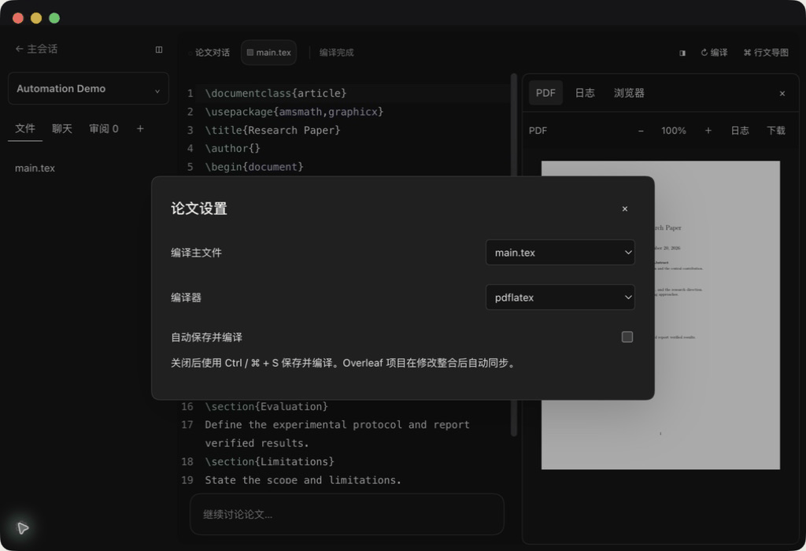
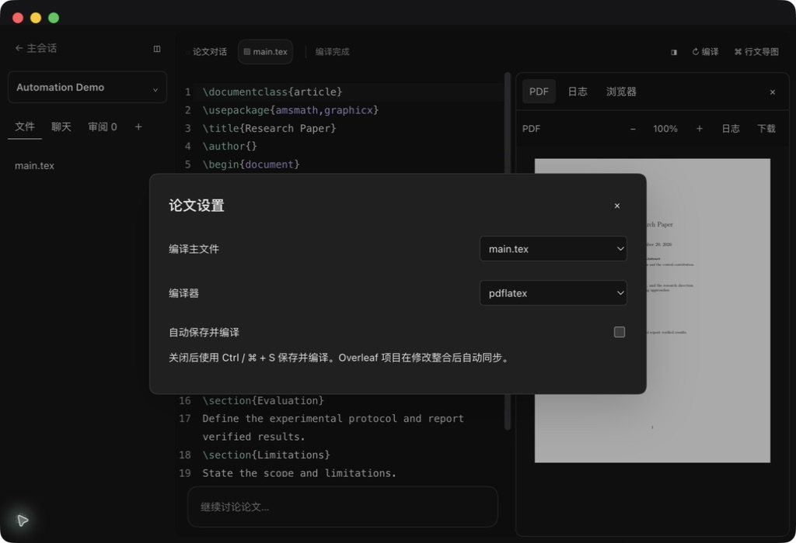
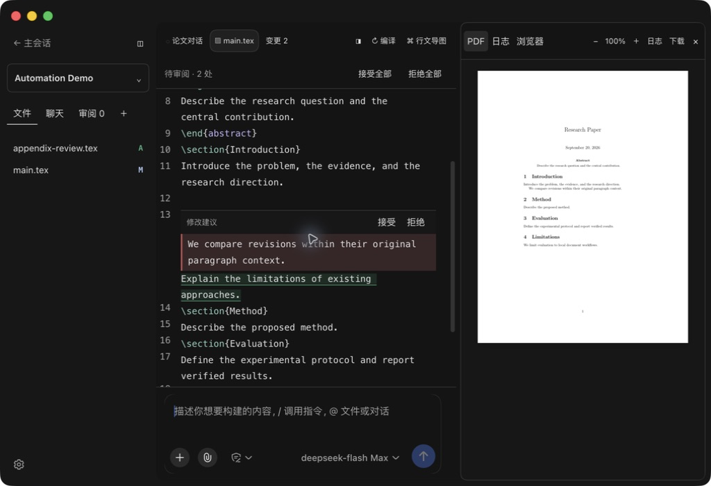

# DSH LaTeX Studio

DSH Desktop 的本地论文工作台：并排编辑 LaTeX 与预览 PDF，通过原生 DeepSeek Harness 会话讨论论文、处理审阅和完善行文逻辑。


演示由实际 Desktop 操作截图组成，展示项目选择、编译预览、审阅、聊天和导图折叠。

## 使用

1. 从左侧「工作流」下方的「论文工作台」进入，选择已有论文、新建论文，或打开本地项目目录。
2. 在源码右上方点击「编译」，使用本地 TeX 工具生成 PDF。支持 PDF 缩放、下载、取消和错误日志。
3. 选中文字，使用「润色」「缩减」或「评论」。评论保存在审阅栏；点击卡片跳转原文。
4. 在审阅卡片右下角选择单条或多条，也可用列表顶部全选框，再点击「加入对话」。材料追加到最近使用的论文会话草稿，由用户检查后发送。单条箭头可直接追加对应审阅。
5. 打开「行文导图」，模型概括标题、章节、段落和句子。分支圆钮控制折叠，单击选中节点，双击节点跳转源码（键盘 Enter 也可定位），画布支持平移和缩放。
6. 点击「主会话」返回原生界面；论文文件、审阅、会话绑定和成功的 PDF 保留在本地。

进入工作台后，Desktop 外侧导航和标准模式标题栏自动隐藏；返回主会话时恢复。点击文件或文件标签进入源码。写作区左侧在源码与论文对话之间切换，底部复用原生输入框，右侧通过 PDF、日志、浏览器页签切换内容，可随时收起或关闭。侧栏可收起，源码与 PDF 栏宽可通过分隔条拖动或方向键调整。支持浅色、深色与跟随 Desktop。

文件栏使用行内输入创建文件：Enter 创建，Esc 取消。编辑器支持多个标签、撤销和 `⌘/Ctrl+S` 保存。文件被 Agent 或外部编辑器修改时，干净编辑器自动同步；存在未保存草稿时执行冲突检查。草稿在本机浏览器存储中保留，冲突恢复支持导出草稿。

## 安装

推荐使用 [DSH Desktop Bundle](https://github.com/hzxwonder/dsh-desktop-bundle) 的固定版本组合。

独立开发安装：

```sh
git clone https://github.com/hzxwonder-dsh-plugins/dsh-plugin-latex.git
cd dsh-plugin-latex
npm ci
npm run build
```

在 Desktop profile 的 `package.json` 中添加本仓库的本地 `link:` 依赖，并将 `dsh-plugin-latex` 加入 `dsh.profile.bundles`，执行 `pnpm install` 后重启 Desktop。修改配置前保留原文件备份。

验证环境：DSH Desktop 2.0.10、DeepSeek Harness 0.1.5-rc.2、Node.js 24、macOS。原生聊天嵌入使用此 Harness 版本的渲染适配层；升级 Harness 后需复测。

本机需安装 TeX Live 或 MacTeX，并提供 `latexmk` 与所选引擎（pdfLaTeX、XeLaTeX、LuaLaTeX）。中文论文请选择合适的中文文档类、字体和 XeLaTeX。编译所需宏包由本机 TeX 安装提供。

## Agent 与数据

聊天、模型选择、文件工具和权限审批沿用 Desktop 的 deepseek-harness。插件复用已有模型路由；论文会话绑定论文目录。语义分析调用同一路由的原生子代理，每次完整加载随插件提供的 [paper-mindmap-update Skill](skills/paper-mindmap-update/SKILL.md)。Agent 按技能概括章节、段落与逐句意图；插件校验结构化结果后写入原文注释，再解析注释生成导图。文件写入和备份由 Host 执行。技能版本改变后首次更新重新分析，后续继续复用未修改段落。

论文工作台使用内部专属 `AGENTS.md`，存放在插件数据目录 `latex-studio/instructions/AGENTS.md`。插件启动时加载其中的写作、审阅和 Overleaf 同步规则，通过 Harness 系统提示词仅注入绑定当前论文目录的会话。文件由插件管理，论文文件栏保持源码与素材视图。

初始页右上角的「全局设置」管理主题、内部 AGENTS.md 和全局 Overleaf 凭证。macOS 使用 Keychain 保存凭证，后续论文项目共用；凭证状态查询只返回是否配置。创建项目可选择从 Overleaf Git 克隆并填写项目链接。

论文内左下角齿轮打开「论文设置」，选择编译器、主文件及「自动保存并编译」。勾选后编辑自动保存和编译；关闭时使用 `⌘/Ctrl+S`。绑定 Overleaf 的论文保存后由工作台同步，冲突与同步错误显示在日志中。

Agent 的聊天编辑、导图注释和外部提案进入修改审阅，源码区展示修改前后差异，支持单项或全部接受、拒绝。待审阅期间暂停同步；全部处理后执行编译和 Overleaf 同步。完整交互留在最近使用的论文会话中。Harness 原生全局和项目指令继续按作用域生效。

## 外部 Agent 接口

运行中的 Desktop 提供当前系统用户可访问的本地 Unix socket。使用随插件提供的 [paper-workbench Skill](skills/paper-workbench/SKILL.md) 和 JSON 客户端列出项目、读取源码、提交修改提案、编译、查询任务与日志。接口写入采用内容哈希检查，提案由用户在 Desktop 审阅。接口不提供凭证读取或审阅决定权限。

```sh
printf '%s' '{"action":"list"}' | node skills/paper-workbench/scripts/paper.mjs
```





模型分析会将相关论文段落发送给用户在 Desktop 中配置的模型服务。普通编辑与编译在本机执行。文件、审阅、PDF、语义缓存和分析前备份保存在所用 DSH home 的 `latex-studio/` 下；导入项目的源码仍位于原目录。插件不包含分析统计上报或独立账号服务。

语义注释使用 `% @c:`、`% @p:`、`% @s:` 描述章节、段落和句子意图。内部定位标识与增量缓存由插件管理。更新时重用未改变段落的分析结果。支持项目根目录相对路径的字面量 `\input{...}`、`\include{...}`，合并章节并保留原文件跳转位置。

## 适用范围

- 结构解析面向 `abstract`、`section`、`subsection`、`subsubsection` 和常规正文。公式、代码、表格、列表等受保护块按源码保留；复杂自定义宏中的文字不保证完整进入语义导图。动态计算的文件引用应先改为字面路径。
- 单文本文件上限 2 MB；编译项目上限 100 MB；PDF 上限 30 MB；语义分析最多递归 64 个 TeX 文件。编译超时约 120 秒，分析任务约 240 秒。
- 编译在临时目录运行，关闭 shell escape；这是编译隔离工作目录，并非操作系统级沙箱。
- 单文件替换采用原子写入和内容哈希检查。多文件分析在写入前校验所有文件并保存原文备份；文件系统级事务、进程崩溃注入与超大论文压力测试尚未完成。
- 首版聚焦本地个人论文与 Agent 协作。

## 验证

```sh
npm test
npm run build
npm run check:privacy
```

自动测试需要 TeX 工具；PDF 正文一致性检查需要 Poppler 的 `pdftotext`。测试中的固定语义数据用于协议和增量逻辑验证；真实模型链路另在 Desktop 界面验收。

详见 [验收计划](https://github.com/hzxwonder-dsh-plugins/dsh-plugin-latex/blob/main/docs/TEST-PLAN.md) 与 [验收报告](https://github.com/hzxwonder-dsh-plugins/dsh-plugin-latex/blob/main/docs/ACCEPTANCE.md)。截图与动图采用合成论文。

## 开发结构

| 路径 | 职责 |
|---|---|
| `index.js` | Cordis Host API、原生模型分析任务与生命周期 |
| `lib/store.js` | 项目与审阅持久化、路径校验、保存冲突 |
| `lib/compiler.js` | 本地编译、超时取消与成功 PDF 保留 |
| `lib/logic.cjs` | 结构解析、语义注释与增量缓存 |
| `lib/project-sources.js` | 多文件引用解析与导图合并 |
| `client/` | CodeMirror 编辑器、PDF.js、审阅与原生聊天抽屉 |
| `test/` | 文件、编译、Host 和语义回归测试 |

MIT License。CodeMirror、PDF.js 等依赖遵循各自许可证。

行文导图已通过 Desktop 真实模型全量与增量验证：首次分析 6 段，未修改复用 6 段，单段修改仅重算 1 段。详细证据与测试范围见[验收报告](docs/ACCEPTANCE.md)。

## Desktop 浏览器与布局

论文浏览器与普通右侧栏可使用 Desktop 的原生浏览器组件，包括地址栏、标签、菜单与状态栏。PDF 缩放和下载集中在右侧顶部；编译和导图位于源码栏右上角。原生嵌入需要 Desktop 客户端提供 `desktop.browser.embedded` 与 `desktop.browser.sidebar` 接口。详见[布局验收与截图](docs/LAYOUT-ACCEPTANCE.md)。

## 源码内审阅

Agent 修改在源码原位置展示前后对比，支持逐处和批量接受、拒绝。文件栏标记新增 A、修改 M、删除 D，全部处理后进行编译与同步。论文设置提供编译主文件、编译器和自动保存选项。



[源码审阅与论文设置验收报告](docs/INLINE-REVIEW-ACCEPTANCE.md)

[输入区与设置文字验收报告](docs/COMPOSER-SETTINGS-ACCEPTANCE.md)

[交互与视觉验收报告](docs/PRODUCT-UX-ACCEPTANCE.md) · [工作台设计规范](design-system/WORKSPACE.md)
