# DSH LaTeX Studio 验收报告

日期：2026-09-19。版本：0.1.7。环境：macOS、DSH Desktop 2.0.10、DeepSeek Harness 0.1.5-rc.2、Node.js 24.11.1、本地 MacTeX。

## 结论

本地论文编辑、真实编译与 PDF 预览、审阅选择、原生模型会话、Agent 文件修改、四级行文导图及增量更新的主要流程已在实际 Desktop 界面运行。23 项自动测试全部通过，构建和发布内容扫描通过。此结果对应上述固定环境，完整跨平台兼容性和极端故障恢复尚未验收。

测试数据为合成的 Research Demo、Methods Note 和临时目录论文。模型调用采用 Desktop 当前配置的真实 deepseek-flash 路由；自动测试中的固定语义响应只用于验证协议与缓存，不作为模型质量证据。

## 全局与论文设置

| 测试项 | 结果 |
|---|---|
| 初始页全局设置入口 | Desktop 实际点击通过 |
| 浅色、深色全局设置 | 实际切换与截图复核通过；恢复用户原有深色主题 |
| 内部 AGENTS.md 保存 | Desktop 保存提示通过；自动测试验证持久化、后续提示词更新、旧版本冲突拒绝、大小限制及项目目录隔离 |
| 左下角论文设置齿轮 | Desktop 点击打开编译设置，通过 |
| 编译器与编译主文件 | 实际切换至 xelatex / notes.tex，检查持久化配置通过；随后恢复 pdflatex / main.tex |
| Escape 关闭设置 | Desktop 实测通过 |
| 文件标签与保存状态间距 | Desktop 源码页面截图复核通过 |

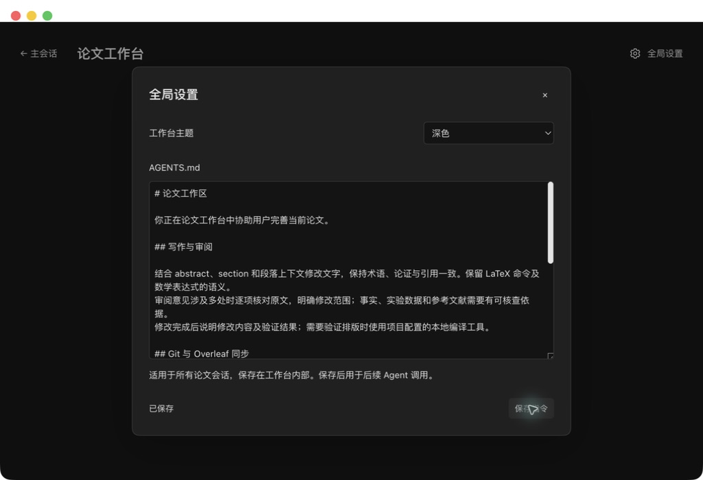
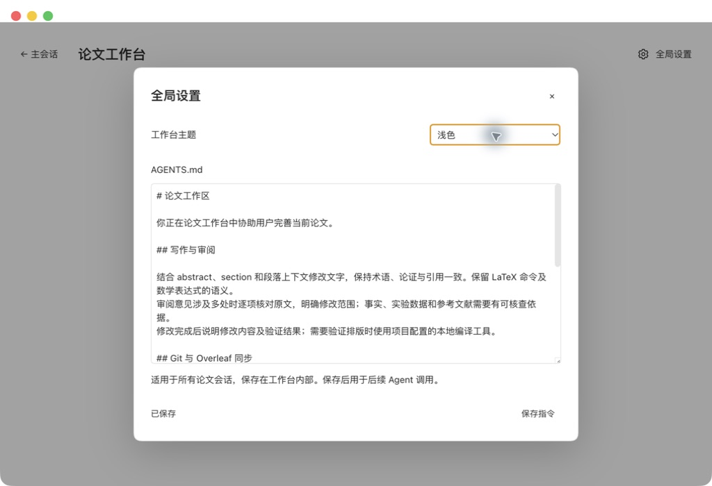
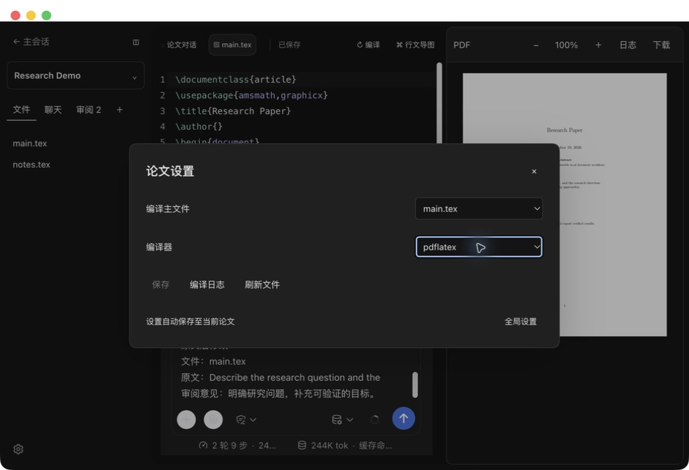
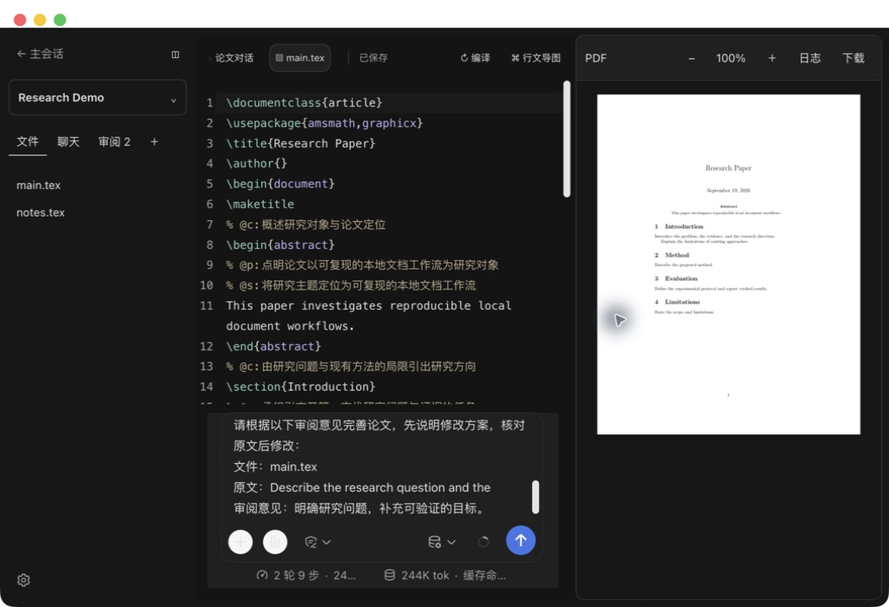

## 行文导图 Skill

| 项目 | 结果 |
|---|---|
| Skill 格式与打包 | quick_validate 校验通过；npm 发布清单包含技能正文 |
| Agent 技能加载 | 实际 Desktop 子 Agent 会话记录确认完整 Skill 原文注入，输入包含文件和章节上下文；Host 回归测试通过 |
| 注释与解析 | 多文件测试验证语义结果写入 `% @p:`、`% @s:`，重新生成带原文件位置的四级节点 |
| 增量更新 | 未修改再次更新 analyzed=0；修改正文后 analyzed=1，并再次调用分析 Agent |
| 源码保护 | 原有冲突校验、备份、正文编译一致性及取消测试通过 |
| 真实模型按钮验收 | 重启 Desktop 后实际点击更新：首次分析 6 段，生成 18 个四级节点；正文不变 |
| 重复更新 | 实际点击后 analyzed=0、reused=6 |
| 单段修改 | Method 增加假设说明后 analyzed=1、changed=1、reused=5；模型输入仅含 Method 的 1 段 |
| 恢复演示原文 | 恢复原句后再次更新，analyzed=1、reused=5；去除插件注释后的全文与测试前一致 |
| 模型输出兼容 | 接受纯 JSON 或单个 JSON 代码块及其外围说明；畸形 JSON、多代码块和覆盖缺失均拒绝写入 |

技能更新以内容摘要识别，首次使用新技能重新分析语义缓存。真实模型返回的语义通过校验后，由 Host 更新源码注释并重新解析导图。实测模型曾在 JSON 前附加说明文字；0.1.6 支持提取单个明确的 JSON 代码块，并保留字段及段落覆盖校验。失败任务保留既有导图，自动测试确认无效响应不改写源码。

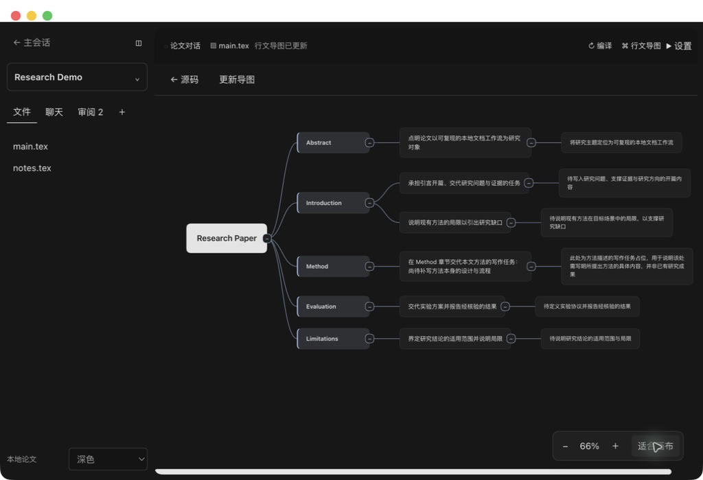

该截图来自 Desktop 实际操作，采用合成论文。会话日志仅在本机核验，不随报告发布。

## 工作台内部指令与导航

| 编号 | 验收结果 |
|---|---|
| I01 | 自动测试通过：内部目录初始化专属 AGENTS.md，已有规则保留 |
| I02 | 自动测试通过：新建和打开论文不创建项目级指令文件 |
| I03 | 自动测试通过：匹配模板移至内部备份，自定义项目规则保留；内部符号链接拒绝加载 |
| I04 | 自动测试通过：系统提示词仅向论文绑定且目录匹配的会话注入内部规则 |
| I05 | Desktop 截图复核：入口采用 16px 线框图标，字体、字重和内边距与工作流一致 |

Desktop 实测：重新打开 Research Demo 后文件栏显示 main.tex、notes.tex；内部规则已加载，项目中自动生成的默认模板已归档到内部备份。

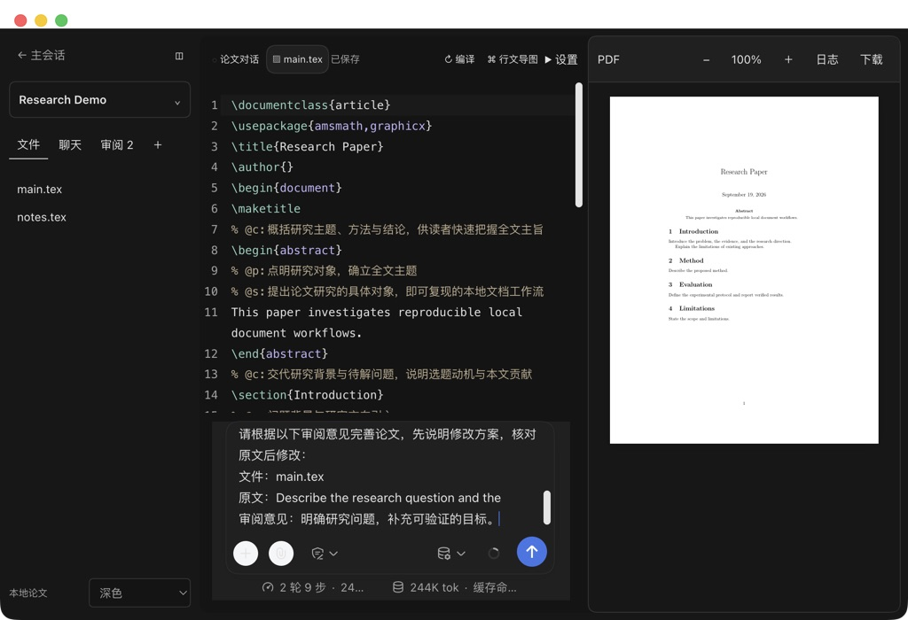

内部指令在插件启动时加载，也可从全局设置保存并即时更新后续调用，论文文件栏不展示。模型按规则执行的遵循效果和 Overleaf 真实远端推送尚未独立验收。

## 工作台导航与论文会话验收

本轮在实际 Desktop 2.0.10 中复核以下项目。真实模型编辑与增量分析的数据沿用同日基础验收，未将本轮提示词单元测试视作 Overleaf 实际同步证据。

| 编号 | 验收动作 | 结果 |
|---|---|---|
| N01 | 展开主侧栏查看工作流下方入口；收起为图标栏后进入论文工作台 | 通过 |
| N02 | 项目选择及工作台隐藏外侧导航；分别从展开与收起状态进入、返回 | 通过；原侧栏状态恢复 |
| N03 | 有两轮消息的原生论文聊天切到 main.tex、notes.tex，再点文件标签 | 通过；短文件保留完整编辑空间，底部为原生输入框 |
| N04 | 源码、历史聊天、导图反复切换 | 通过；原草稿、PDF 保留，标准模式标题隐藏 |
| N05 | 浅色、深色、项目名称箭头、审阅卡片、导图适合画布 | 通过；见截图 |
| N06 | 绑定会话系统提示词、未绑定会话、目录不匹配、无 Agent 上下文 | 自动测试通过；规则限定于论文绑定会话 |
| N07 | Agent 向真实 Overleaf 远端提交并推送 | 未执行；未提供测试 Overleaf 远端及凭据 |
| N08 | 导图单击 Abstract，随后双击 Abstract | 通过；单击选中，双击定位 abstract 原文 |

论文规则保存在工作台内部 AGENTS.md；Harness 的动态 systemPrompt variable/section 为论文会话注入指令。编辑器手动保存、编译和语义导图注释写入本身不触发 Git 提交。已有历史消息的提示词记录对应当时运行，新增规则用于后续 Agent 调用。

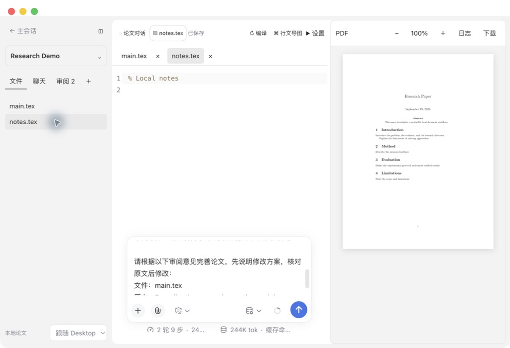

## 交互与样式回归

| 编号 | 验收动作 | 结果 |
|---|---|---|
| U01 | 左侧工作流下方入口、项目选择、返回主会话 | 通过 |
| U02 | 源码与左侧会话反复切换，比较长草稿与 PDF | 通过；草稿内容和 PDF 保留 |
| U03 | 两组审阅长草稿，检查模型与发送控件 | 通过；输入区内部滚动，外层布局稳定 |
| U04 | Desktop 正反向拖选行中字符、键盘扩选；浏览器组件双击选词 | 通过；选区高亮可见，拖选结束显示操作栏 |
| U05 | Abstract 单击后仍在导图；双击后源码选择 abstract 环境起始行 | 通过 |
| U06 | 折叠 Abstract、折叠根节点、重新展开 | 通过；按可见节点绘制曲线 |
| U07 | 浅色、深色、跟随 Desktop 浅色；检查文字与分支按钮 | 通过；系统切换事件未强制触发 |
| U08 | 全选两条审阅，加入最近论文会话 | 通过；追加原草稿，不发送 |
| U09 | 在真实 Desktop 点击编译 | 通过；状态为编译完成，PDF 正常显示 |
| U10 | 对照网页原型；浏览器加载真实编辑器组件 | 写作区布局与主题已对照；完整插件浏览器入口受本机浏览器访问限制，未完成整页端到端验收 |
| U11 | 收起侧栏、重新展开；Tab 聚焦分隔条后左右键调整 55、57、55 | 通过；指针拖动分隔条未取得可靠自动化证据 |

源码编辑器与原生会话在视图切换期间保持挂载。原生会话后端继续使用 Desktop 配置的 Harness 模型和工具；此版本回归未重复发送真实模型消息，既有真实调用与文件修改证据见 A01/A02。

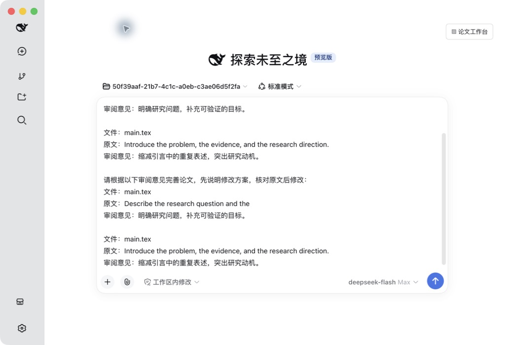
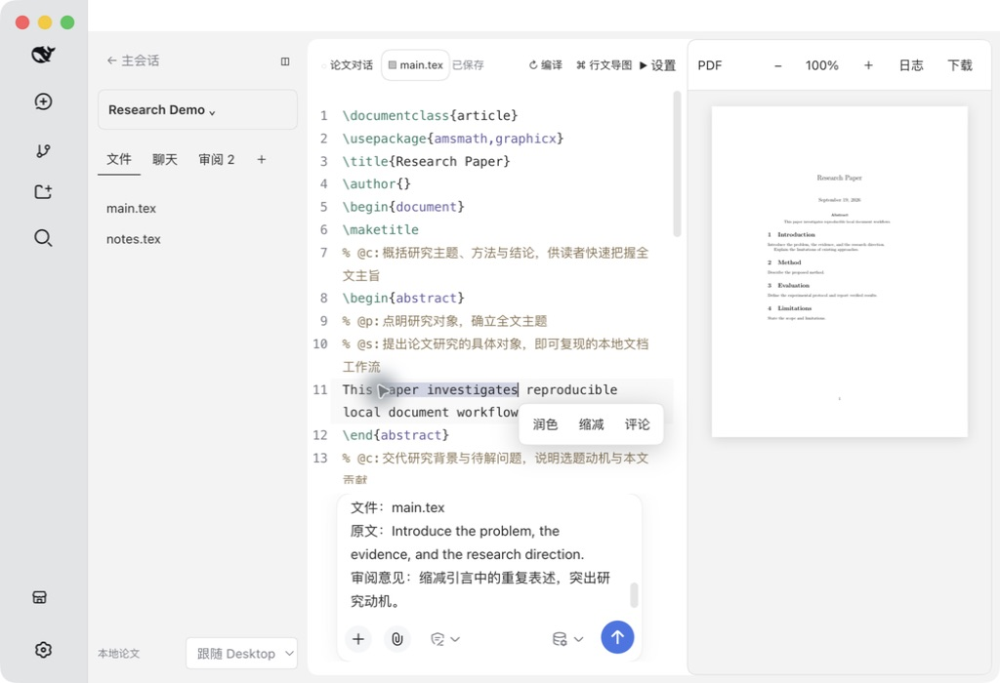
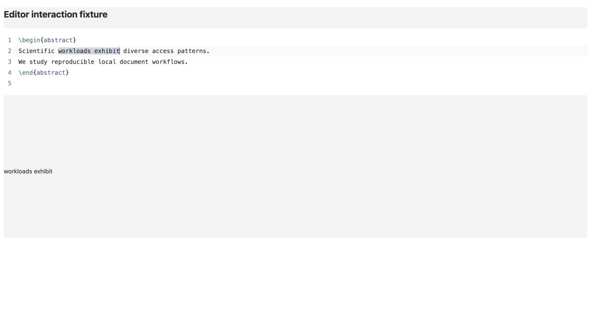
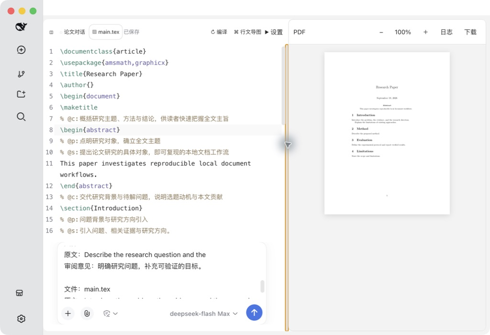

浏览器组件验收可复现：运行 `node scripts/build-interaction-fixture.mjs`，在输出目录启动本地静态服务器。页面导入生产 Editor 组件，使用合成 LaTeX 文本，不连接模型或论文目录。

## 自动测试

运行 `npm test`，结果见 [原始测试输出](test-output.txt)。

| 序号 | 测试 | 结果 |
|---|---|---|
| 1 | 项目持久化、重复目录导入复用 | 通过 |
| 2 | 外部文件变化后拒绝覆盖 | 通过 |
| 3 | 行内文件创建、重复名称、路径越界、符号链接 | 通过 |
| 4 | 会话绑定与最近会话持久化 | 通过 |
| 5 | 语义注释与未变段落复用、最近章节定位 | 通过 |
| 6 | 真实编译生成 PDF；语法错误保留上次成功 PDF | 通过 |
| 7 | 子进程取消、超时、缺少可执行文件 | 通过 |
| 8 | 缩写、行内公式、注释及公式环境保护 | 通过 |
| 9 | 缺少模型语义时拒绝生成 | 通过 |
| 10 | 子目录主文件真实编译 | 通过 |
| 11 | 多文件引用、继承章节上下文与循环引用拒绝 | 通过 |
| 12 | 合并导图保持文件位置与同名章节归属 | 通过 |
| 13 | Host API 错误与会话工作目录隔离 | 通过 |
| 14 | 审阅引用限定绑定会话 | 通过 |
| 15 | 公共项目响应隐藏内部语义快照 | 通过 |
| 16 | 多文件分析写回；第二次分析复用全部段落 | 通过 |
| 17 | 注释前后真实编译 PDF 提取正文一致 | 通过 |
| 18–20 | 内部论文指令初始化、作用域、项目文件隔离 | 通过 |
| 21 | 畸形 JSON、空值、多代码块、缺少段落覆盖时保护原文 | 通过 |
| 22 | 带说明文字的单个 JSON 代码块解析与完整写回 | 通过 |

## Desktop 行为验收

| 计划项 | 实际操作与证据 | 结论 |
|---|---|---|
| P01 | 新建两篇论文，第二篇初始无审阅和 PDF；切回第一篇恢复原文件与两条审阅 | 通过 |
| P02 | 重复导入通过自动测试；已有目录导入入口已实现 | UI 导入未单独遍历 |
| P03 | 非法路径和符号链接由自动测试覆盖 | 无权限目录未实测 |
| P04 | 多次退出并重启 Desktop，再打开原论文，文件、审阅、PDF、原生会话仍存在 | 通过 |
| F01 | 文件栏加号后直接输入 notes.tex，Enter 创建 | 通过；Esc 分支已实现，未录屏单测 |
| F02/F03 | 重复与嵌套创建、越界、链接拒绝由自动测试覆盖 | 通过 |
| F04 | 同时打开 main.tex 和 notes.tex，保存后关闭 notes.tex，恢复 main.tex | 通过；其他关闭排列未穷举 |
| F05 | 编辑 notes.tex 并快捷键保存；重启恢复已有文件 | 通过；崩溃时草稿恢复未注入故障 |
| F06 | Agent 修改摘要后编辑器读取更新；CAS 自动测试保留外部版本 | 通过 |
| C01 | 点击编译出现真实 PDF 页面；125% 放大和适合宽度有效；已有 PDF 在重启后再次渲染 | 通过；系统下载目录写入未单独验收 |
| C02 | 语法错误和缺少可执行文件由自动测试覆盖 | 通过；缺包组合未穷举 |
| C03 | 取消、超时子进程测试通过；运行期间编译按钮禁用 | 通过；UI 高频连击压力未执行 |
| C04 | 子目录主文件真实编译；多文件解析和模型协议由自动测试覆盖 | 通过；复杂多文件模板未实测 |
| C05 | 编译状态带源码哈希检查，项目结果按项目 ID 归属 | 代码复核；并发 UI 压力未执行 |
| R01 | Desktop 正反向拖选行中的 paper investigates；键盘扩选；操作栏贴近选区 | 通过；浏览器组件另验证 workloads exhibit 和双击选词 |
| R02 | 添加两条独立评论；导图定位选区可评论；列表保留原文与意见 | 通过；解决状态排列未全部验收 |
| R03 | 全选得到 2 条，取消单条后计数 1 且全选框为半选 | 通过 |
| R04 | 选中条目追加到原有会话；再点单条箭头，原草稿仍保留；发送按钮等待用户操作 | 通过 |
| R05 | 原文唯一匹配重新定位，无法匹配时报错；分析更新会标记失效锚点 | 代码复核，重复引用 UI 未实测 |
| A01 | 原生模型返回“论文会话已连接” | 通过 |
| A02 | 原生 Agent 使用文件工具将摘要改为指定演示句；编辑器显示新内容 | 通过；本次权限模式无需弹出额外审批，拒绝审批分支未测试 |
| A03 | 源码与左侧论文对话切换；重新打开同一会话，草稿仍在 | 通过 |
| A04 | 多次加入审阅均使用同一论文会话 | 通过；显式新建多会话切换未穷举 |
| M01/M02 | 真实模型生成标题→章节→段落意图→句子意图，Abstract/Introduction 等正确归属 | 通过 |
| M03 | 摘要改变后真实模型更新：analyzed=1、changed=1、reused=5；其余段落复用；最终版本未修改再更新为 analyzed=0、reused=6 | 通过 |
| M04 | 模型返回结构有覆盖与长度校验；任务支持中止 | 格式验证代码复核，真实模型断网与超时未注入 |
| M05 | 行内公式、缩写、注释及受保护环境有回归覆盖，注释前后 PDF 文本相同 | 支持常规正文；复杂宏/混合语言分句仍有边界 |
| M06 | 展开/收起 Introduction；单击节点选中、双击节点定位源码 | 通过；大图平移压力未执行 |
| V01 | 浅色、深色源码与导图截图复核；原生论文对话适配工作台主题 | 见截图；系统自动切换事件未强制触发 |
| V02 | 1024×700 窗口实际操作，左侧源码与会话切换，右侧保留 PDF | 通过；超窄窗口与长文本极值未穷举 |
| V03 | 多次工作台、侧栏与论文对话切换、Desktop 重启 | 通过；长时内存泄漏测试未执行 |
| S01 | 扫描源码、锁文件、构建产物；人工检查发布截图与 GIF | 通过，见隐私范围 |
| S02 | 插件注册、重启与原生会话恢复实测 | 通过；插件卸载未在用户 profile 中执行 |

## 界面证据

项目选择：

源码与真实 PDF：

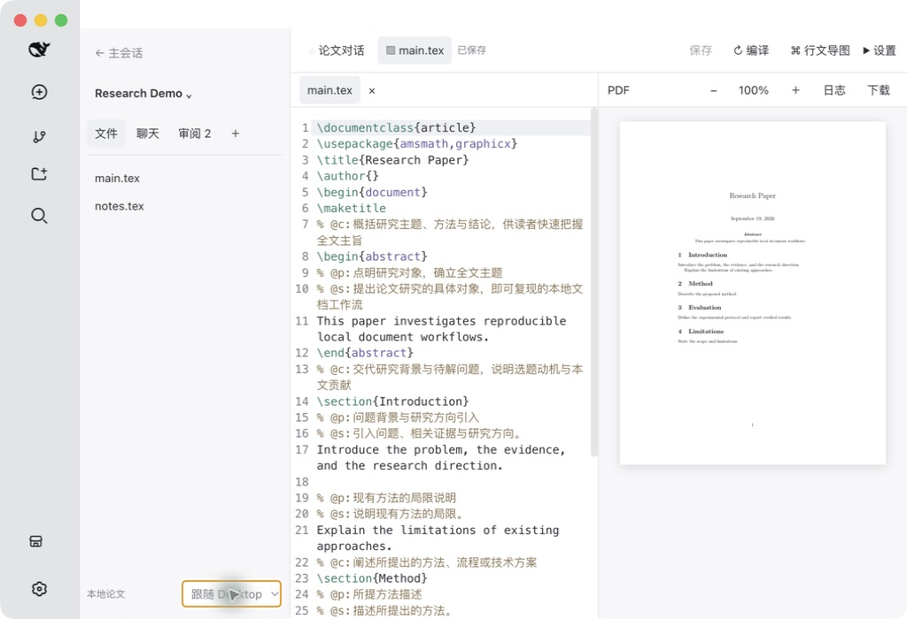

审阅列表与深色源码：

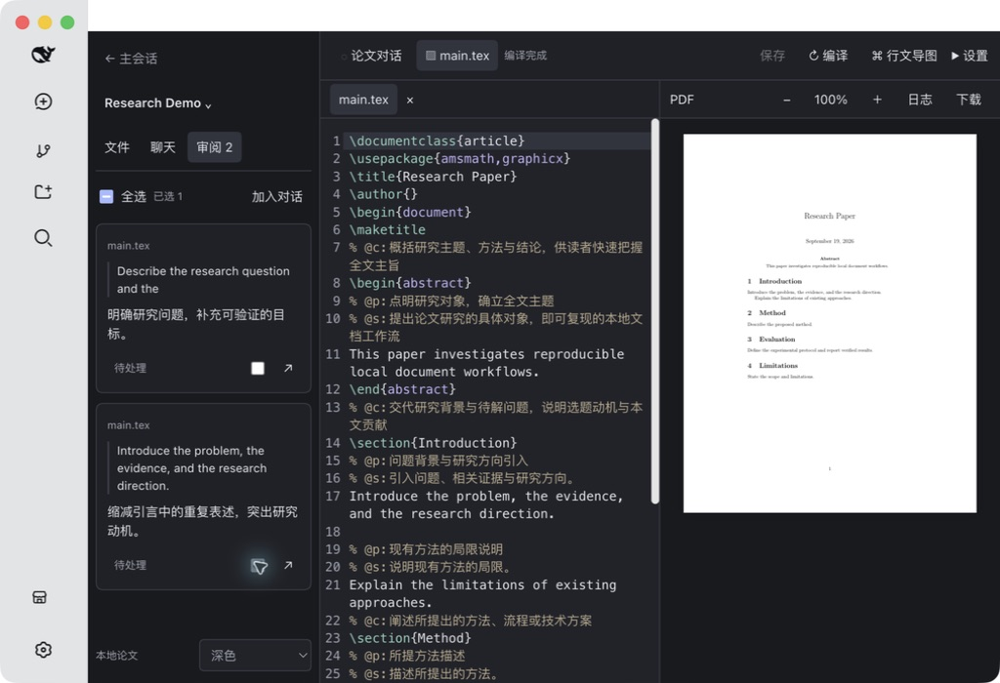

真实模型生成的行文导图：

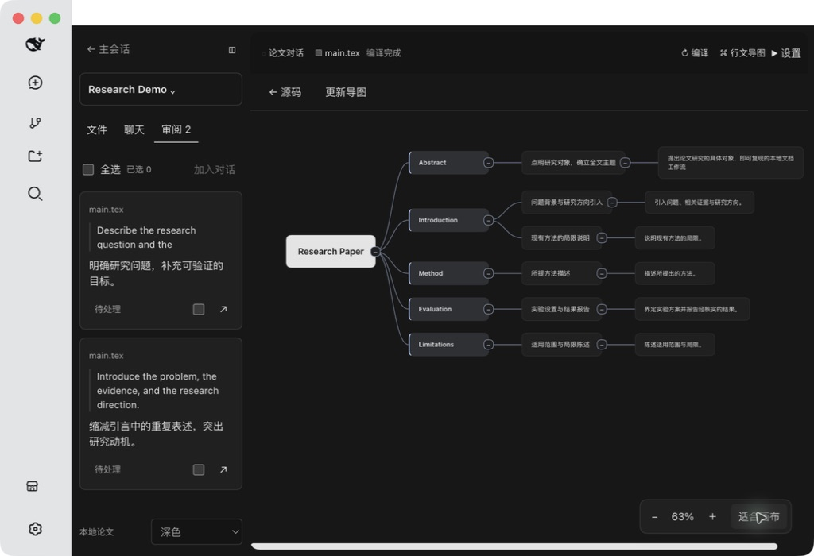

原生 Agent 论文对话：

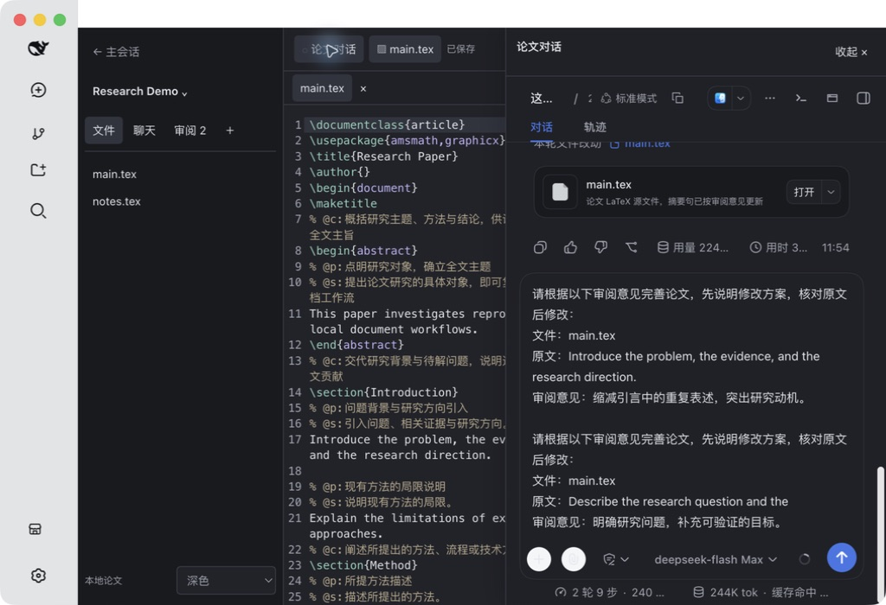

## 隐私范围

公开内容仅包含插件源码、依赖锁文件、构建产物、文档及合成论文截图。模型凭据、Desktop 设置、原有会话、论文目录和备份不纳入 Git 仓库。源码扫描检查常见 token、私钥与个人绝对路径；截图和 GIF 逐帧查看。自动扫描并非对任意格式敏感信息的形式化证明。

插件普通编辑和编译在本机进行。点击模型分析或发送聊天消息时，相应内容会交给用户当前配置的模型服务。验收截图不包含模型配置、访问密钥和无关工作区列表。

## 后续验收边界

Windows/Linux、不同 TeX 发行版、动态宏引用、长篇多文件论文、外部编辑器并发竞争、磁盘满、进程崩溃及网络故障注入尚需专门测试。多文件保存不是文件系统级整体事务；分析前原文备份保存在本机。首版按已列明的本地常规论文范围交付，不将未执行项标记为通过。
