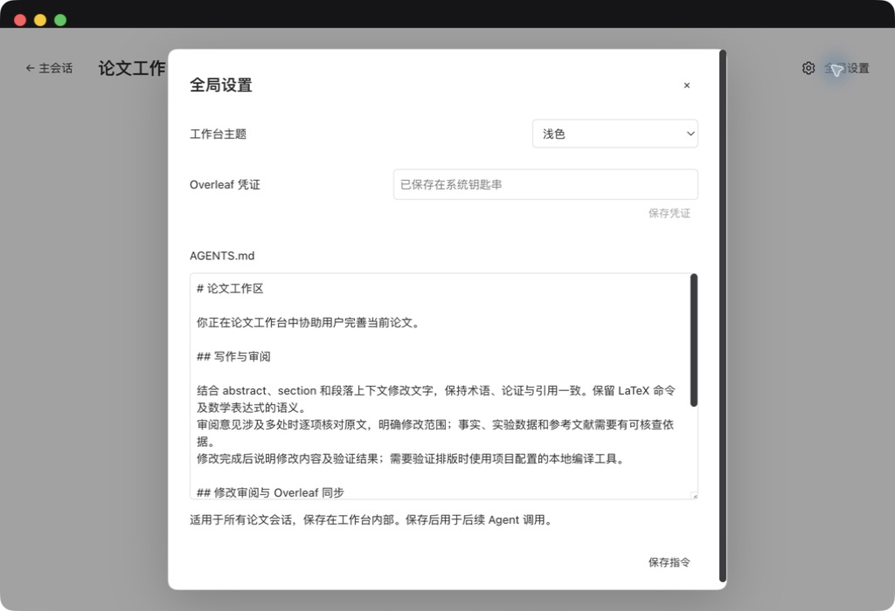
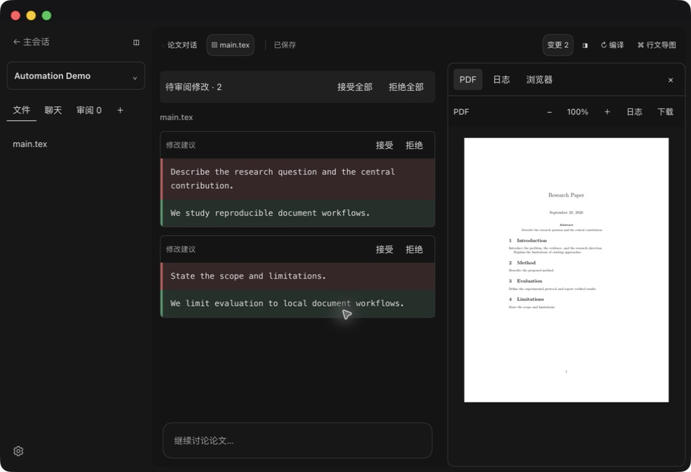
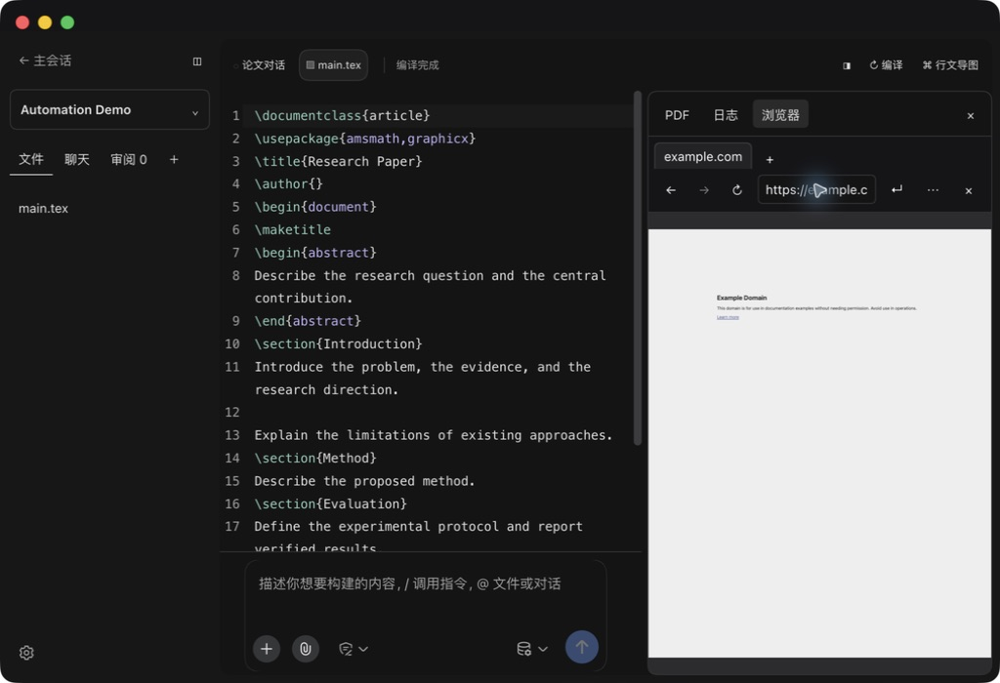

# DSH LaTeX Studio 验收报告

日期：2026-09-20。版本：0.1.8。环境：macOS、DSH Desktop 2.0.10、DeepSeek Harness 0.1.5-rc.2、Node.js 24、本地 MacTeX。

## 结论与范围

36 项自动测试通过。实际 Desktop 已验证 Overleaf 克隆、系统凭证保存、保存后编译和真实推送、Agent 修改审阅、单项混合决策、重启恢复、右侧 PDF / 日志 / 会话浏览器。构建、Skill 格式和源码隐私扫描通过。

测试使用合成论文和经用户授权的 Overleaf 测试项目。本文不包含项目链接、令牌、个人目录或会话原始记录。截图采用 Automation Demo。功能通过不代表任意 LaTeX 宏、操作系统、网络和进程故障组合均已验证。

## 真实交互记录

| 编号 | 操作与判定标准 | 结果与证据 |
|---|---|---|
| D01 | 从 Overleaf Git 创建项目，发现 main.tex | 通过，实际克隆并打开 |
| D02 | 全局保存凭证；重新查询只返回配置状态 | 通过，macOS Keychain，配置状态为 true |
| D03 | 手动模式编辑，保存前显示未保存 | 通过，Desktop 实际编辑 |
| D04 | Ctrl+S 保存，编译后同步 Overleaf | 通过，真实 push，状态为已同步 Overleaf |
| D05 | 自动保存复选框持久化并触发保存/编译 | 通过，编辑后进入流水线；测试后恢复手动模式 |
| D06 | 源码输入复用最近论文会话 | 通过，真实 Agent 文件修改产生 1 处待审阅项 |
| D07 | Agent 审阅前保持远端不变 | 通过，Git HEAD 对照保持一致 |
| D08 | 拒绝全部后恢复源码 | 通过，真实 Agent 注释恢复，远端不变 |
| D09 | 外部 Agent 提交两处修改 | 通过，界面显示变更 2 |
| D10 | 重启后待审阅状态保留 | 通过，重新进入项目仍显示变更 2 |
| D11 | 拒绝一条、接受另一条 | 通过，剩余计数由 2 到 1，再清零；源码只保留接受内容 |
| D12 | 最后一项处理完自动编译 | 通过，显示修改已整合、正在编译，随后编译完成 |
| D13 | 差异只显示变化句子 | 通过，未变化的 preamble、section 命令不进入差异卡片 |
| D14 | PDF / 日志 / 浏览器切换 | 通过，PDF 渲染与编译日志可查看 |
| D15 | 连接会话浏览器并访问 example.com | 通过，实际页面标题 Example Domain，地址栏和页面可见 |
| D16 | 关闭右侧面板 | 通过，内容与分隔条一同隐藏，显示展开入口 |
| D17 | 多项目与主会话之间切换 | 通过，项目列表、源码和主会话均可重新进入 |
| D18 | 深色设置、源码、差异与输入区 | 通过，截图检查文字对比与边界 |
| D19 | 浅色全局设置 | 通过，实际切换并复核；随后恢复深色 |
| D20 | 内部默认 AGENTS.md 升级 | 通过，当前默认规则迁移为工作台统一管理审阅与同步；自定义规则由测试验证保留 |
| D21 | 外部接口 list/open/read/status/logs/propose | 通过，运行中 Desktop 返回有效结构和两处提案 |

## 自动化回归清单

以下各行来自本版本实际执行的 node:test 结果。测试覆盖功能机制，界面行为以以上 Desktop 记录为准。

| 编号 | 测试 | 结果 |
|---|---|---|
| A01 | automation socket supports structured responses, private permissions and stale-owner protection | 通过 |
| A02 | projects persist and duplicate imports reuse identity | 通过 |
| A03 | file writes preserve external edits using compare-and-swap | 通过 |
| A04 | inline creation rejects duplicate, traversal and symlink escape | 通过 |
| A05 | review metadata and chat membership persist | 通过 |
| A06 | semantic annotations reuse unchanged paragraphs and locate sections | 通过 |
| A07 | compiler creates real PDF and retains last successful result after error | 通过 |
| A08 | subprocess cancellation, timeout and missing executable | 通过 |
| A09 | semantic splitting preserves abbreviations, inline math and comments | 通过 |
| A10 | analysis requires complete model data and does not invent semantics | 通过 |
| A11 | nested main file compiles with root-relative input | 通过 |
| A12 | multi-file traversal inherits section context and rejects cycles | 通过 |
| A13 | merged maps retain file locations and group common sections | 通过 |
| A14 | annotation preserves compiled prose and paragraph boundaries | 通过 |
| A15 | Host routes report errors and fence conversation roots | 通过 |
| A16 | review material expands only for bound sessions | 通过 |
| A17 | public project responses keep semantic snapshots internal | 通过 |
| A18 | multi-file analysis annotates source files and reuses all unchanged paragraphs | 通过 |
| A19 | paper system guidance is restricted to bound project sessions | 通过 |
| A20 | paper instructions stay outside project files | 通过 |
| A21 | invalid semantic output leaves paper source and map unchanged | 通过 |
| A22 | semantic JSON block accepts a model preface | 通过 |
| A23 | global instructions persist and apply to subsequent paper prompts | 通过 |
| A24 | native Agent edits enter review and Git push is guarded | 通过 |
| A25 | internal instructions persist and archive only matching project templates | 通过 |
| A26 | Overleaf sync commits only selected files and preserves unrelated staged content | 通过 |
| A27 | pending reviews block push and remote divergence reports changed files | 通过 |
| A28 | missing global credentials reports a recoverable sync error | 通过 |
| A29 | rejecting a newly proposed file leaves synchronization clean | 通过 |
| A30 | sentence changes preserve exact text and allow mixed decisions | 通过 |
| A31 | review blocks overlap and applies single and bulk decisions | 通过 |
| A32 | review survives restart and rejects external edits without overwrite | 通过 |
| A33 | new and deleted source files can be rejected as one batch | 通过 |
| A34 | active Agent changes cannot be accepted before capture completes | 通过 |
| A35 | Overleaf address validator restricts protocol, host and credentials | 通过 |
| A36 | review diffs exclude unchanged LaTeX preamble and section commands | 通过 |

## 发布检查

| 检查 | 结果 |
|---|---|
| npm test | 36 通过，0 失败 |
| npm run build | 通过 |
| npm run check:privacy | 通过，包含 Overleaf token、私钥、GitHub token、API key、个人绝对路径与项目链接规则 |
| git diff --check | 通过 |
| paper-workbench Skill 格式 | quick_validate 通过 |
| 截图人工复核 | 新截图仅显示合成论文、通用浏览器站点及配置状态 |
| 凭证隔离 | 凭证位于系统 Keychain；不进入 Git remote、项目文件或公开报告 |

## 待专项验证的场景

以下测试项已列入计划，但不能据现有证据判定通过：Windows/Linux 系统凭证存储，钥匙串锁定与权限拒绝，真实网络断线和认证失效，进程在多文件写入中被强制终止，磁盘耗尽，超大论文压力，多客户端同时提交同一项目，真实远端多人同时编辑造成的竞争，所有屏幕尺寸和辅助技术组合。

远端领先、未合并冲突和无关暂存文件保护已在本地 Git 测试仓库验证；真实 Overleaf 仅验证正常推送及审阅期间不推送。macOS 是本次凭证功能的支持平台。外部接口限定为同一 OS 用户的自动化能力，不作为多租户安全边界。Agent shell 工具的命令检查与系统提示词用于协作约束，不构成恶意 shell 的系统级沙箱。

完整行为范围见 [验收计划](AUTOMATION-TEST-PLAN.md)。基础编辑器、评论、导图布局及真实模型增量验证记录见 [0.1.7 基础验收](ACCEPTANCE-0.1.7.md)，该记录注明自身版本，不代替本版新功能测试。
