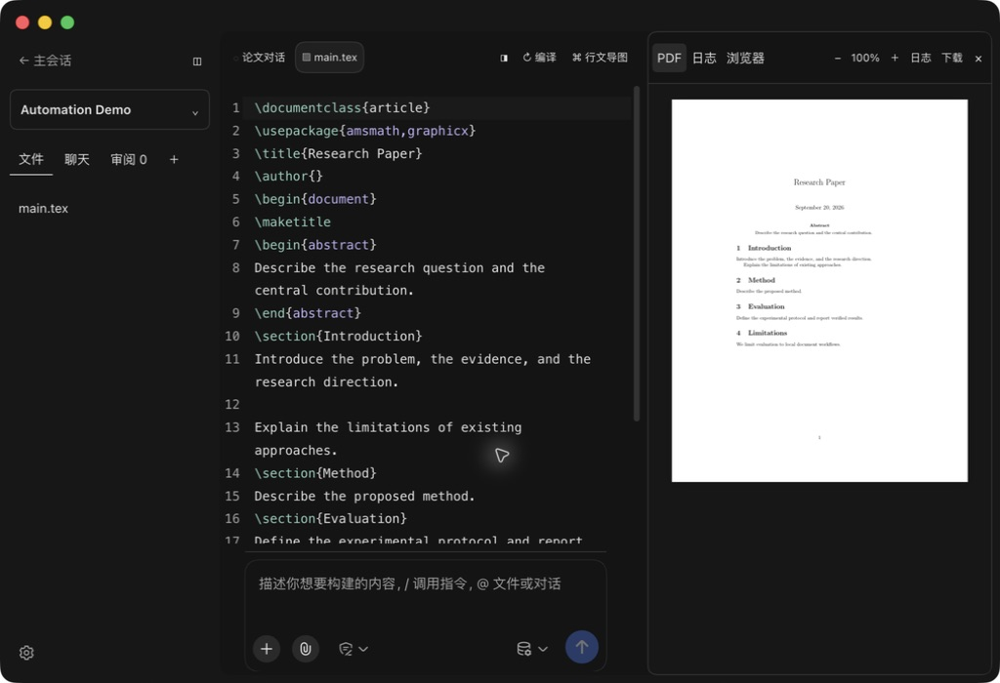
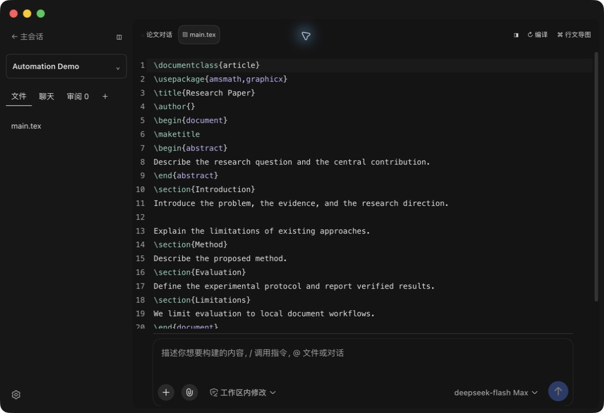
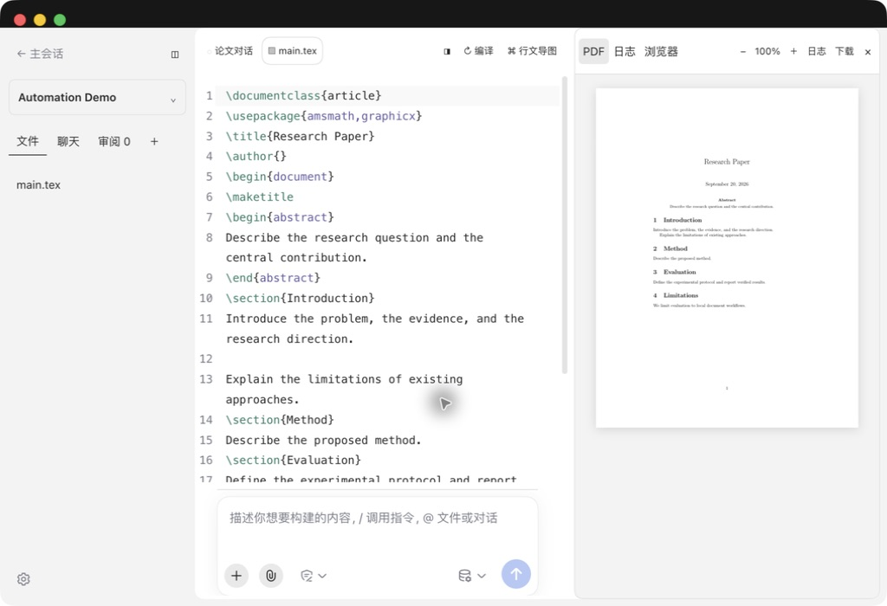
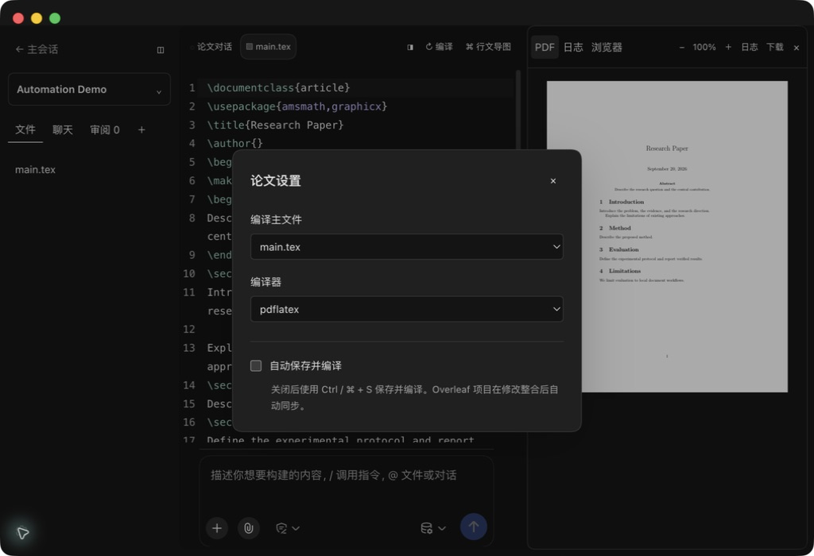
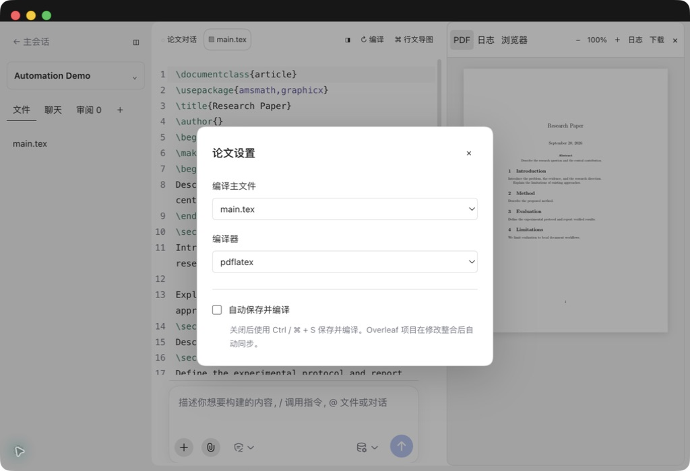

# 输入区与设置文字验收

版本：0.1.11。

设置中的说明使用独立的辅助文字样式：12 px、常规字重、主题对应的次级文字颜色和 1.7 倍行高。字段名称及输入内容保持主要文字样式。

输入框采用原生 Desktop 的内边距、宽度约束及圆角。上方分隔线与输入框共享容器和最大宽度，随面板宽度调整保持左右两端对齐。

- 客户端构建通过。
- 源码与文档隐私扫描通过。
- 此版本调整展示样式，审阅和保存编译逻辑沿用 0.1.10 的 37 项通过结果。

界面验证截图见下方。

| 实际操作 | 结果 |
| --- | --- |
| 深色窄面板：分隔线与输入框两端对齐 | 通过 |
| 收起右侧面板：分隔线随输入框扩展 | 通过 |
| 重新打开右侧面板 | 通过 |
| 浅色窄面板：分隔线与输入框两端对齐 | 通过 |
| 全局设置中的 AGENTS.md 说明层级 | 通过 |
| 深色论文设置辅助文字 | 通过 |
| 浅色论文设置辅助文字 | 通过 |

