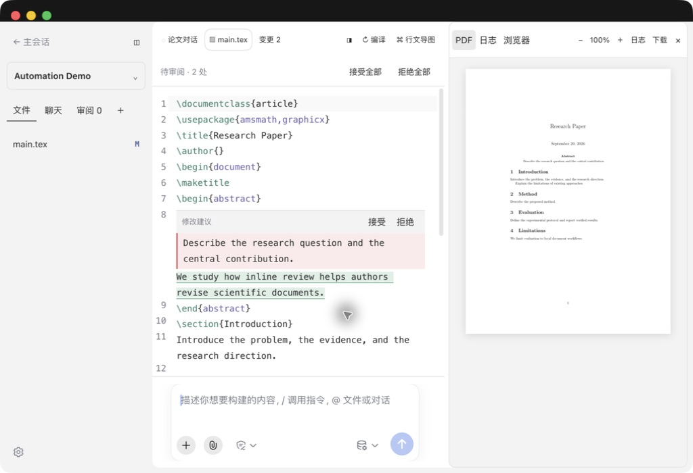
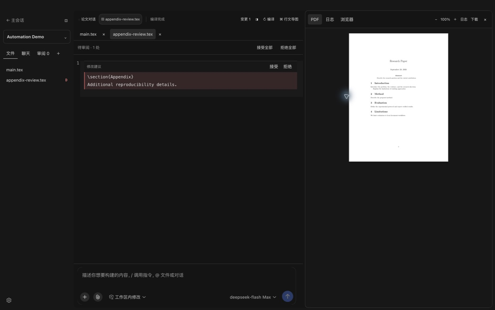
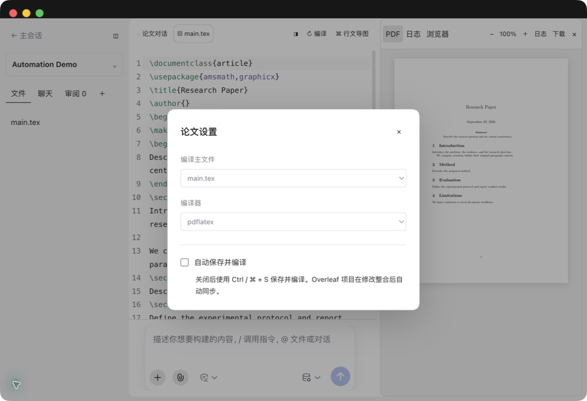
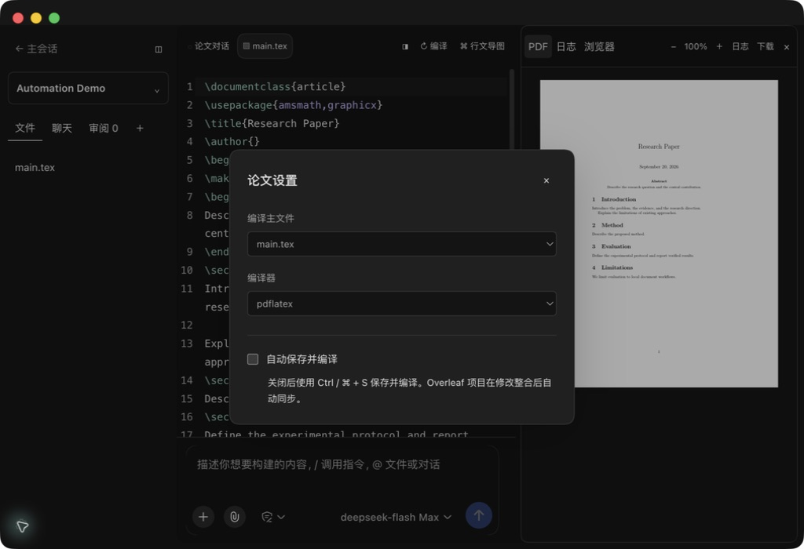

# 源码审阅与论文设置验收

版本：0.1.10。环境：macOS、DSH Desktop 2.0.10。测试项目：Automation Demo 合成论文。

源码编辑器保留章节、段落和未修改的上下文，在对应位置展示原文及建议文本。每处支持接受或拒绝，顶部支持批量处理。文件栏以 A / M / D 表示待审阅的新增、修改和删除。

## 验收结果

| 检查项 | 方法 | 结果 |
| --- | --- | --- |
| 两处句子修改保留 abstract、section 及上下文 | Desktop 实际操作 | 通过 |
| 拒绝一处后保留另一处建议 | Desktop 点击并检查源码 | 通过 |
| 接受剩余修改并自动编译 | Desktop 点击及编译状态 | 通过 |
| 跨文件修改逐项接受 | Desktop 实际操作 | 通过 |
| 新增文件显示 A 并预览内容 | 外部接口提案、Desktop 打开 | 通过 |
| 修改文件显示 M | Desktop 实际检查 | 通过 |
| 删除文件显示 D 并保留原文预览 | 外部接口提案、Desktop 切换文件 | 通过 |
| 删除提案接受后文件消失 | Desktop 实际操作 | 通过 |
| 重启后恢复待审阅批次 | 重启 Desktop 后打开项目 | 通过 |
| 浅色、深色审阅文字对比 | 截图逐项检查 | 通过 |
| 论文设置字段、复选框与说明完整 | Desktop 实际操作 | 通过 |
| 源码与 PDF 工具栏顶部对齐 | 两种主题及编译状态检查 | 通过 |
| 输入框横向间距 | 深色主题实际检查 | 通过 |
| 正常编译提示 | 使用中性进度行和工具栏状态；代码检查 | 通过 |
| 新增、删除、修改分类及混合决定 | 自动化测试 | 通过 |
| 外部修改冲突、重启持久化、活动 Agent 防护 | 自动化测试 | 通过 |
| 审阅完成后同步、待审阅阻止推送 | 本地 Git 自动化测试 | 通过 |
| 本地 LaTeX 真实编译 | 自动化测试 | 通过 |
| 构建 | npm run build | 通过 |
| 测试套件 | npm test | 37 / 37 通过 |
| 凭证、私有路径与项目地址扫描 | npm run check:privacy | 通过 |
| 发布截图隐私 | 人工逐张检查 | 仅合成论文及应用控件 |

本次网络同步验证采用本地 Git 测试仓库；未对用户的 Overleaf 项目提交测试变更。源码审阅期间当前提案文件只读，完成审阅后恢复编辑。

## 界面证据

### 浅色源码审阅

### 深色源码审阅

### 删除文件预览

### 论文设置

### 深色论文设置

批量拒绝新增文件已通过 Desktop 实际点击验证，文件及打开标签同步移除。演示论文原文已恢复，待审阅批次已清空。
