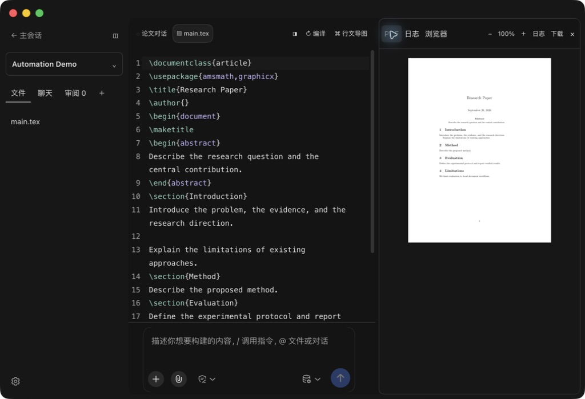
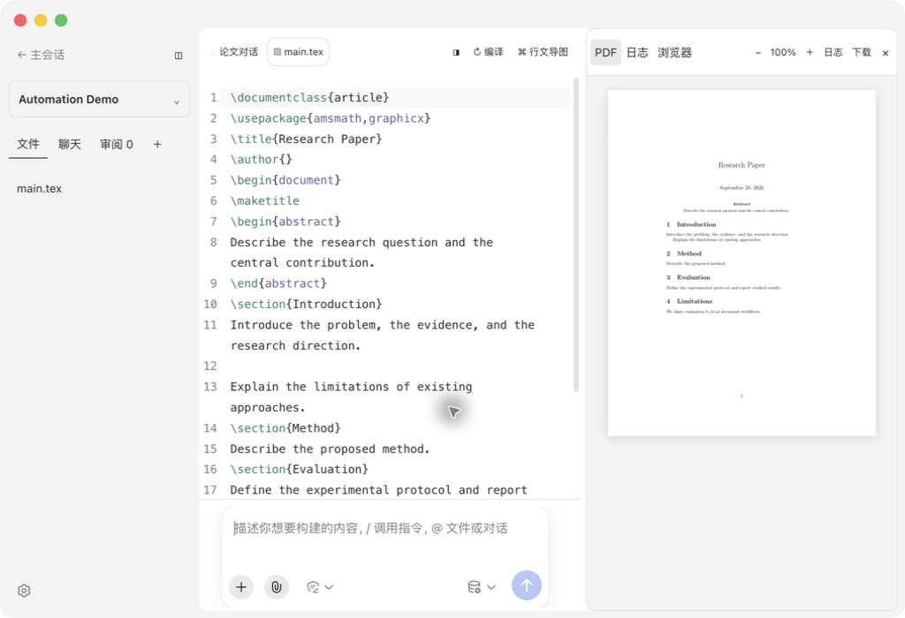
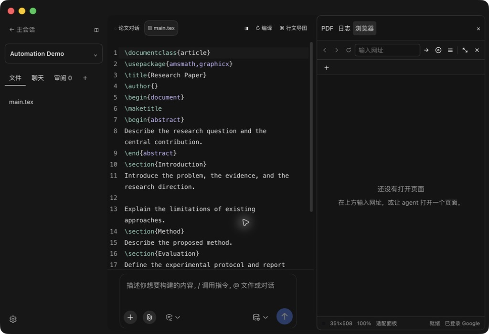

# 论文工作台布局验收

日期：2026-09-20。论文插件 0.1.9，浏览器插件 0.5.2，Desktop 2.0.10 本机更新的客户端。测试使用合成论文 Automation Demo。

| 项目 | 验证结果 |
|---|---|
| 深色指令和附件按钮 | Desktop 实际截图通过，采用工作台背景与文字颜色 |
| 浅色工作台 | 实际主题切换通过，输入框、源码和 PDF 区域清晰 |
| 顶部窗口背景 | 跟随论文主题，macOS 窗口控制区保留 |
| 源码操作位置 | 编译、导图与侧栏开关位于源码栏右上角 |
| 右侧栏位置 | 与源码工具栏顶边对齐 |
| PDF 工具 | 位于页签行；实测 100% → 125% → 100% |
| 论文浏览器 | 使用 Desktop 原生组件，实际打开 Example Domain |
| 浏览器收起和重新打开 | 网页与标签在本轮运行中保留，面板关闭时网页退出可见区域 |
| PDF 与浏览器切换 | 实际切换通过 |
| 普通右侧栏浏览器 | 从主会话右侧栏入口打开，显示 Desktop 地址栏、标签、菜单、窗口控制和状态栏 |
| 重启 | 实际加载成功，项目列表正常 |
| 自动测试 | 论文插件 36 通过；浏览器插件 42 通过、2 跳过；Desktop 稳定与 Beta 各 31 项浏览器相关测试通过 |
| 构建和类型 | 插件构建、两版 Desktop 类型检查、共享源码一致性检查通过 |
| 隐私 | 源码扫描通过；公开截图只含合成论文和通用配置状态 |

原生嵌入需要包含 `desktop.browser.embedded`、`desktop.browser.sidebar` 接口的 Desktop 客户端。本机已安装该客户端。其他安装需更新 Desktop；浏览器插件保留 Web 与旧版客户端的既有浏览器实现。网页自身的配色由网页决定。

本轮验证聚焦布局、主题、嵌入与面板生命周期；沿用已有编译和审阅自动回归，不将其描述为重新执行了全部真实 Overleaf 测试。
