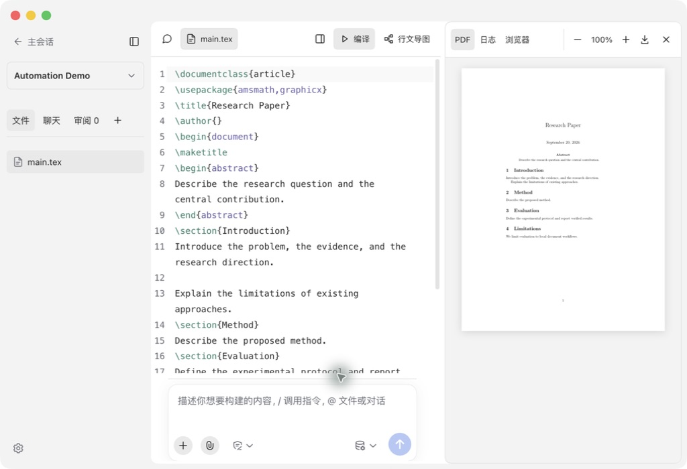
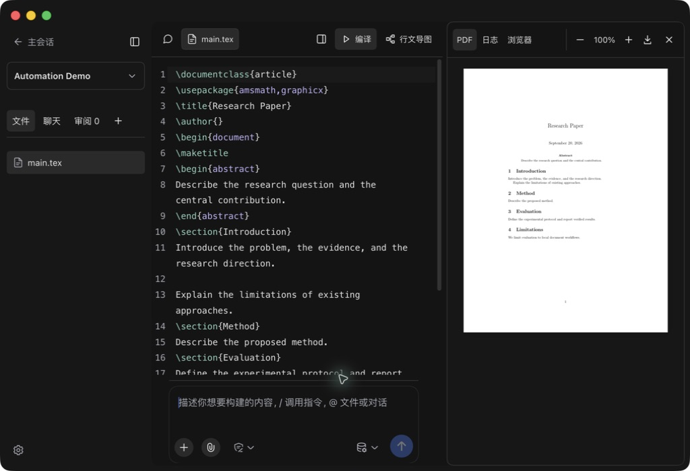
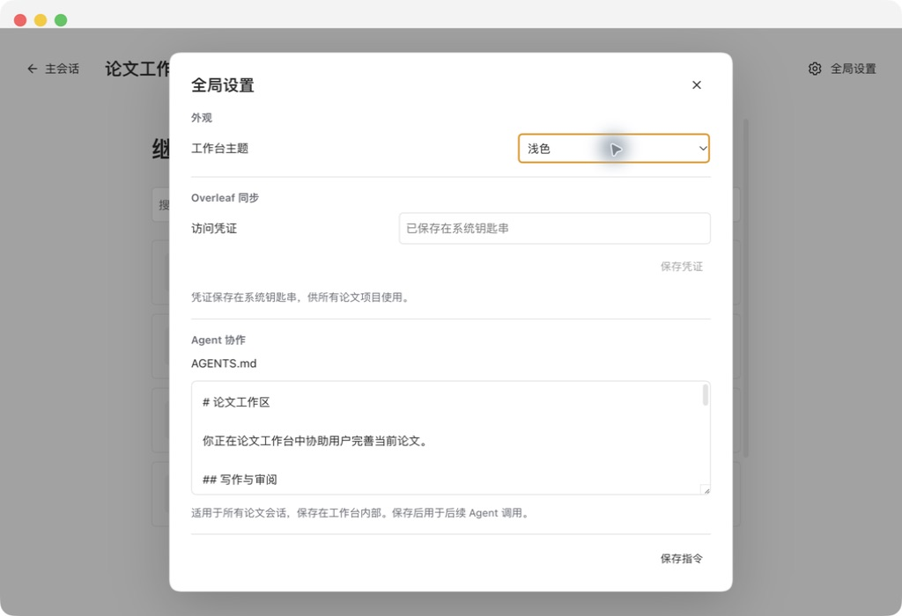
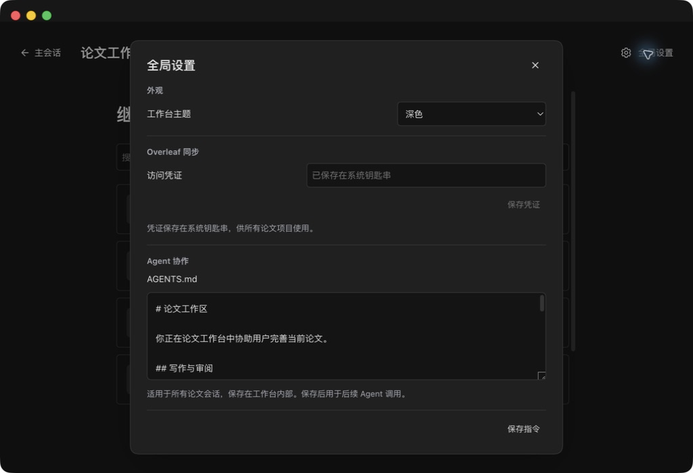
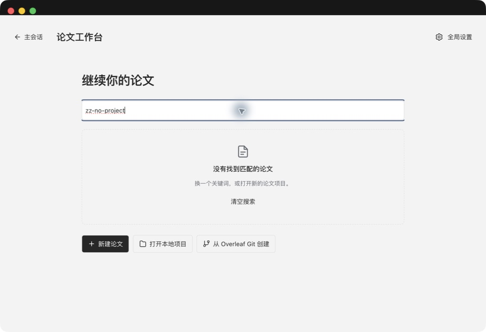

# 论文工作台交互与视觉验收

版本：0.1.12。目标平台：macOS Desktop。使用合成论文 Automation Demo 进行界面检查。

## 设计与实现

- 工作台：统一 SVG 线性图标、32 px 主操作和明确的选中状态；窄栏按宽度保留操作及可访问名称。
- 预览：PDF、日志、浏览器共用顶部导航，缩放和下载为独立控件。
- 项目选择：论文名称和主文件分层；搜索无结果时给出清空搜索入口。
- 设置：外观、Overleaf 同步、Agent 协作分组；辅助文案与字段区分；较矮窗口使用紧凑布局。
- 键盘：设置焦点循环包含复选框，关闭后返回触发按钮。
- 视觉：4/8 px 间距，语义颜色变量；保留源码、PDF、原生对话框及其对齐分隔线。

设计契约见 [工作台设计规范](../design-system/WORKSPACE.md)。

## 验证记录

| 检查 | 证据与结果 |
| --- | --- |
| 构建 | npm run build 通过 |
| 回归测试 | npm test 37 / 37 通过 |
| 隐私扫描 | npm run check:privacy 通过 |
| 搜索无匹配 | 实际键入查询，显示无结果说明与清空入口 |
| 清空搜索 | 点击后恢复项目列表 |
| 图标操作名称 | Desktop 可访问性树显示编译、导图、面板与 PDF 控件名称 |
| 设置焦点循环 | 关闭按钮上 Shift+Tab 到自动保存复选框 |
| Escape 关闭 | 焦点回到论文设置入口 |
| 浅色辅助文字对比度 | 白底 5.51:1，侧栏底色 4.97:1 |
| 深色辅助文字对比度 | 7.07:1 |
| 主要文字对比度 | 浅色 14.94:1，深色 14.49:1 |

对比度为设计色值计算；没有宣称完成正式 WCAG 合规测试。本轮没有招募用户，不将界面检查表述为用户研究或体验指标提升。手机、触屏、系统最大字号和屏幕阅读器完整流程未覆盖。

## Desktop 实机检查

- 深色、浅色工作台的工具栏、文件图标、文字和对话框分隔线已截图检查。
- 全局设置在 1024 × 700 窗口中完整展示保存指令按钮。
- 编译按钮点击后进入禁用与进度状态，完成后恢复可用并展示 PDF。
- PDF 缩放实际完成 100% → 125% → 100%。
- 收起和恢复右侧面板后，源码、对话框及工具栏保持可用。
- 自动化操作未成功触发分栏拖动/方向键调整，本项本轮未验证。
- 发布截图逐张检查，仅包含演示论文、公开默认指令和控件；不包含凭证值或私有项目地址。

