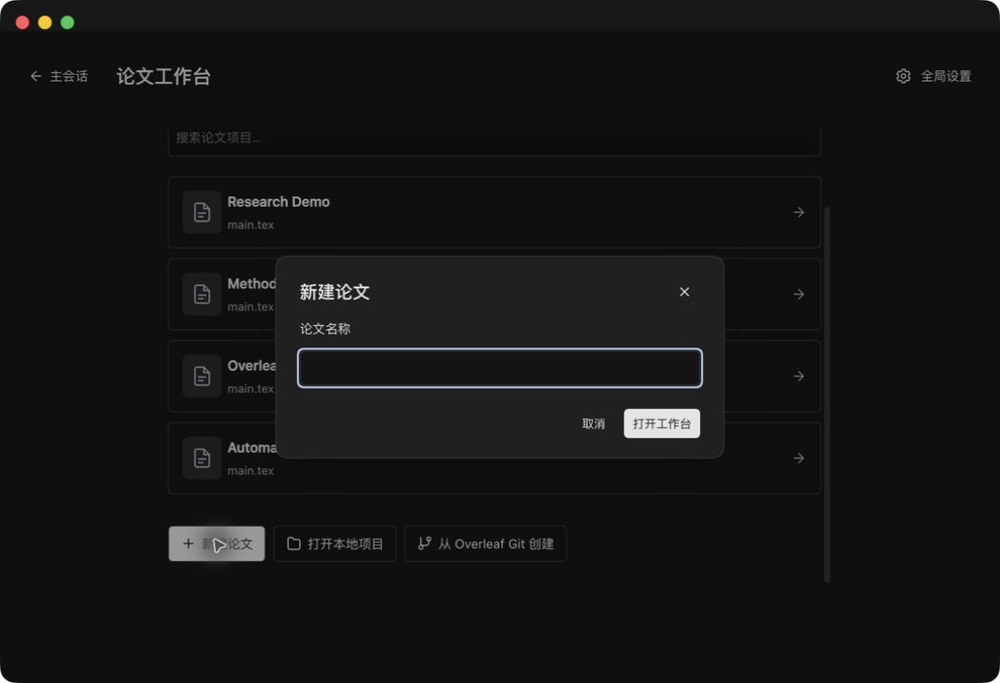
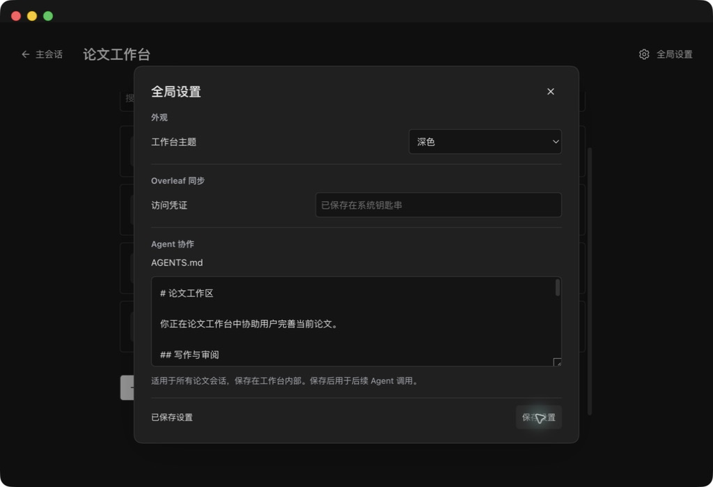

# 项目创建与全局设置验收

版本：0.1.13

创建论文、本地导入和 Overleaf 导入使用独立弹窗。Overleaf 项目仅需 Git 链接，默认名称为 Overleaf 与项目标识末六位。全局设置通过底部“保存设置”提交指令、可选凭证和主题，凭证留空保留现有值。

| 验收项 | 方式与结果 |
| --- | --- |
| 新建论文弹窗、输入自动聚焦 | Desktop 实测通过 |
| Overleaf 仅链接输入 | Desktop 实测通过 |
| 无效链接提示与输入保留 | Desktop 实测通过 |
| 取消与 Escape 返回入口 | Desktop 实测通过 |
| Shift+Tab 焦点循环 | Desktop 实测通过 |
| 全局设置单一保存入口 | Desktop 实测通过 |
| 主题通过保存按钮应用 | Desktop 实测通过 |
| 已有凭证留空保存 | Desktop 实测配置状态保留 |
| 深浅主题布局 | Desktop 截图检查通过 |
| URL-only 克隆、名称与主文件识别 | 本地 Git fixture 自动测试通过 |
| 自动化回归 | 38 项通过 |
| 构建、隐私扫描、diff 检查 | 通过 |

本次远端 Overleaf 服务克隆及钥匙串写入失败未进行现场注入测试。保存流程保留错误提示和输入；指令保存成功而凭证失败时会明确提示部分完成。截图仅含演示项目与通用指令，经人工检查不包含凭证、私有链接或论文正文。

